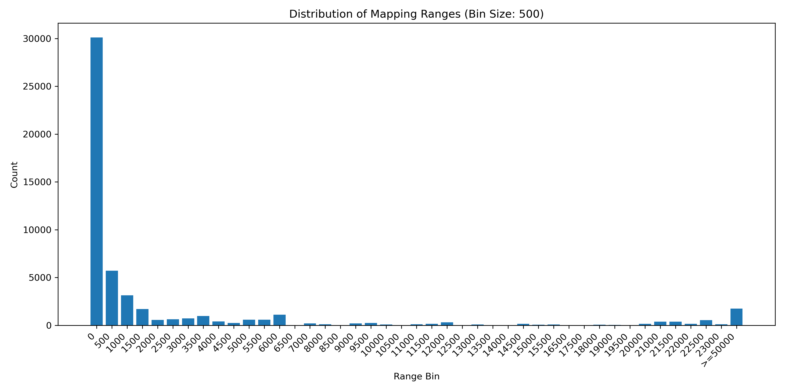
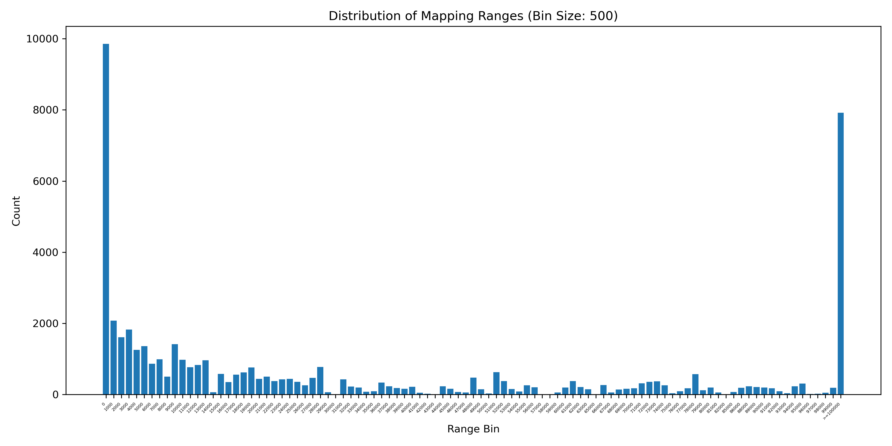
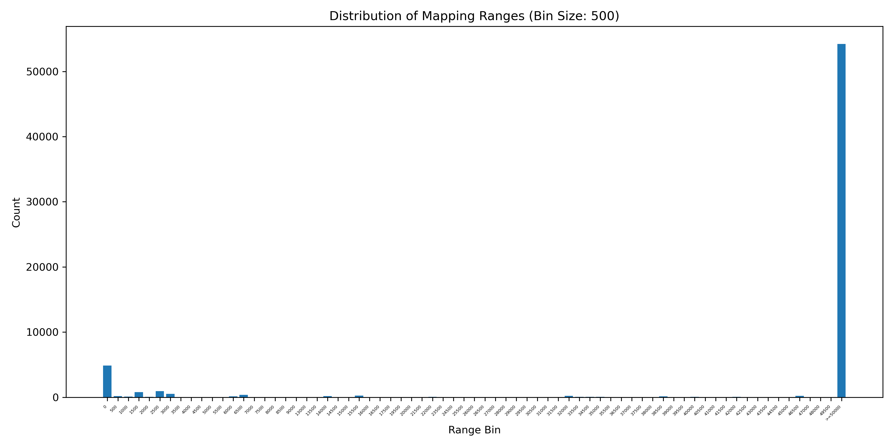
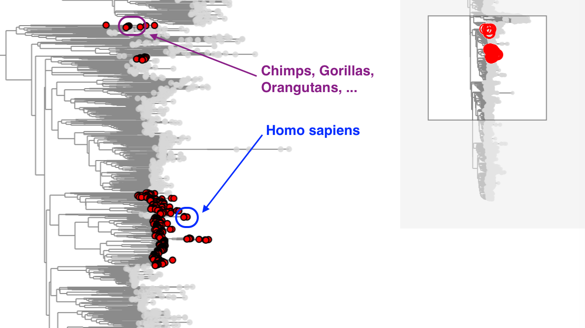
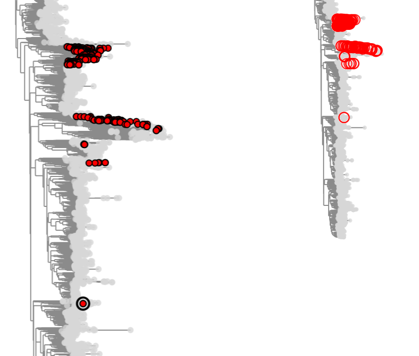

# Lab notebook

This notebook will track the progress of my work in the lab.

## 2025

[Jan](#1302025) &nbsp; [Feb](#212025) &nbsp; [Mar](#392025) &nbsp; [Sep](#9192025) &nbsp; [Oct](#1012025) &nbsp;

[Nov](#1132025)

## 1/30/2025

### panMANIA

~~To build the panMAN using Dockerfile, see [panmania/build_panman/](panmania/build_panman/) directory.~~
To build the panMAN see notes on [2/2/2025](#222025).

PanMAN built using Dockerfile is broken. Currently using Summit's docker image.

## 1/31/2025

### panMANIA

Today I want to start by examining the alignments of sequences on a panMAN. I will write scripts that would compare the
global alignments of sequences from the panMAN to the alignments of sequences using mafft. I expect to see that the
mafft alignments should be better than from the panMAN because panMAN alignments are from MSA of all the sequences while
mafft only compares two sequences at a time. Big differences, however, indicate particular problematic alignments,
likely on the block level.

Inside evaluate_alignments, `parse_newick_to_pairs.py` is a script that would parse the newick tree and output the
parent-child pairs in depth first order. The sequences of each parent-child pair will be compared.

Following commands will generate the pairs, run the alignment comparison, and plot the alignment differences.

```
python parse_newick_to_pairs.py data/hiv/hiv_panman.newick > data/hiv/hiv20000_pairs.tsv

sbatch evaluate_alignments/evaluate_alignments_hiv.sh

python evaluate_alignments/plot_alignment_diff.py \
  evaluate_alignments/out/hiv20000_alignment_differences.tsv \
  evaluate_alignments/data/hiv/hiv20000_pairs.tsv \
  hiv \
  evaluate_alignments/out/hiv20000_alignment_differences.png
```

For results, see [panmania/evaluate_alignments](panmania/evaluate_alignments).

## 2/1/2025

### panMANIA

I realized that there are newer versions of panmans availble. I'm going to build the latest version of panman and look
at the alignments comparison again for newer panmans.

## 2/2/2025

### panMANIA

Build using Sumit's Docker image.

Set up
```
cd /private/groups/corbettlab/alan/panmania/
git clone https://github.com/TurakhiaLab/panman.git

cd panman
```

Pull the PanMAN docker image from DockerHub
```
docker pull swalia14/panman:latest
```

Run the docker container and mount the panman directory
```
docker run -it -v .:/local_panman swalia14/panman:latest
```

Edit the CMakeLists.txt by adding the following lines between `TARGET_LINK_LIBRARIES(...)` and
`target_include_directories(...)`

```
add_custom_command(TARGET panmanUtils POST_BUILD
    COMMAND mkdir -p ${CMAKE_BINARY_DIR}/lib
    COMMAND cp /usr/local/lib/libcapnp*.so* ${CMAKE_BINARY_DIR}/lib/
    COMMAND cp /usr/local/lib/libkj*.so* ${CMAKE_BINARY_DIR}/lib/
    COMMAND cp /usr/lib/x86_64-linux-gnu/libboost*.so* ${CMAKE_BINARY_DIR}/lib/
    COMMAND cp /usr/lib/x86_64-linux-gnu/libprotobuf*.so* ${CMAKE_BINARY_DIR}/lib/
    COMMAND cp ${CMAKE_BINARY_DIR}/tbb_cmake_build/tbb_cmake_build_subdir_release/libtbb*.so* ${CMAKE_BINARY_DIR}/lib/
)
```

Run the install script
```
./install/installationUbuntu.sh
```

Add this line to .bashrc and now panmanUtils can be ran outside the docker container
```
export LD_LIBRARY_PATH=$LD_LIBRARY_PATH:/private/groups/corbettlab/alan/panmania/panman/build/lib
```

Will develop panMANIA using this container for now.

## 2/3/2025

### To-do

- [ ] Make a figure that shows the correlation between the pseudo-chaining score and the alignment score.
- [ ] Fix `position_info_by_haplotype` bug in `heuristic_v6.py`.
- [ ] Complete the alignment quality assessment for new panMANs.

### Logistics and general work

I have started writing the specific aim section of my thesis proposal. For aim 1, other than figures for accuracy
assessment, I think I can also have figure that shows the correlation between the pseudo-chaining score and the
alignment score.

### panMAMA

When I'm in the progress of formalizing the method for calling consensus, I noticed a pretty significant bug in
`heuristic_v6.py` that gives inconsistent `position_info_by_haplotype` for the same haplotype.
`position_info_by_haplotype` is a dictionary that stores other haplotypes' position info at a specific aligned position.

Will need to fix this before I can continue with the formalization.

### panMANIA

The panMAN gives `Exceeded message traversal limit` error for SARS and HIV trees. The reason is that the default message
traversal limit is too small.

To fix this, replace `uint64_t traversalLimitInWords = 8 * 1024 * 1024 * 128` in
`/home/capnproto-c++-1.0.2/src/capnp/message.h` with `uint64_t traversalLimitInWords = 8 * 1024 * 1024 * 256`.

Then run command below to rebuild capnproto.
```
make clean && ./configure && make -j && make install
```

\
As a continuation of `2/1/2025`, I need to assess the alignment quality of the new panMANs. Writing and split the fasta
files for nodes on the panMANs are currently taking too long for `SARS_20000` and `HIV20000`.

## 2/4/2025

### To-do

- [ ] Complete the alignment quality assessment for new panMANs.
- [ ] Make a figure that illustrates the effectiveness of pseudo-chaining scores at discerning between sequences.
- [x] ~~Make a figure that shows the correlation between the pseudo-chaining score and the alignment score.~~ *need to* 
*find a better way to illustrate this*
- [x] ~~Fix `position_info_by_haplotype` bug in `heuristic_v6.py`.~~ *Was redefining `pos` in debug print statements.*

### panMAMA

To make the pseudo-chaining score vs sequence similarity figure (refer to `2/3/2025`), I'm going to write a script that
would give all 150-bp kmers from a random node (preferably containing no ambiguous bases, `OM857280.1`) and generate 50
mutated kmers from each kmer, each containg 1 - 50 mutations. Then I will calculate align them using minimap2 and
pseudo-chaining and compare their scores. Scripts and data are placed in
`/private/groups/corbettlab/alan/lab_notebook/panmama/pseudo_chaining-vs-sequence_similarity`.

The final figure is saved in `panmama/pseudo_chaining-vs-sequence_similarity/pseudo_chaining_vs_seq_similarity.png`. It
doesn't look very good... A better to illustrate the effectiveness of pseudochaining is to show how it's able to discern
between haplotypes, since we only care about if it's sensitive enough to tell different sequences apart.

## 2/5/2025

### To-do

- [ ] Finish writing the first draft of the specific aim section of my thesis proposal.
- [ ] Really do finish formalizing the method for calling consensus.

### Logistics and general work

#### Meeting with Russ
I talked a little about panMANIA then the consensus calling step with Russ. Russ gave a really good sugesstion on
assuming there no back mutations. See notes below in panMAMA section.

### panMANIA

I just plotted the alignment differences for the new SARS and RSV panMANs (HIV is skipped because it's taking too long.
Seems like the aligned sequences in the new HIV panMAN are very long). The new SARS panMAN looks pretty identical to the
old SARs panMAN but **the new RSV panMAN looks **worse** than the old one**. See
[panmania/evaluate_alignments](panmania/evaluate_alignments) for more details.

Maybe it is worth to also fix the alignments in panMAN for Aim 2.

Notes below need to be beautified and executed. This is a place holder so I don't forget

*I have an idea to identify problematic block states. Will try to implement and see how it goes.*
- *Record positions of mismatches in the panMAN alignment. Merge positions into ranges. Identify nearby ranges with* 
  *identical lengths of mismatches.*
- *Nearby ranges with identical lengths of mismatches are likely to be problematic block states.*
- *Try to align those two ranges together and see how well they align.*


### panMAMA

Notes below need to be beautified and executed. This is a place holder so I don't forget

*Russ has a good idea to call consensus*
- *Assume there's not back mutation*
- *If there is a cryptic mutation, assign that cryptic mutation heuristically*
  - *If there are haplotypes where that cryptic mutation is assigned to that haplotype only, assign it.*
  - *If not use maximum likelihood.*
- *If no cryptic mutation, assign reference*

## 2/6/2025

### To-do

- [ ] Really do finish formalizing the method for calling consensus.
- [x] ~~Finish writing the first draft of the specific aim section of my thesis proposal.~~
      *See [thesis_proposal/](thesis_proposal/)directory for the draft*

### Logistics and general work

I finished the first draft of my specific aims section for my thesis proposal. Aim 3 still needs a lot of work. See
[thesis_proposal/](thesis_proposal/) section for the first draft.

### panMANIA

With the limited time I have today, I will write up the script for identifying problematic block states that cause large
chunks of misalignment. See [panmania/evaluate_alignments/](panmania/evaluate_alignments/) for details

## 2/7/2025

### To-do

- [ ] Really do finish formalizing the method for calling consensus.
- [ ] Quantify the prevalence of problematic block states

### panMANIA

Working on quantifying the prevalence of problematic block states

## 2/9/2025

### To-do

- [x] ~~Really do finish formalizing the method for calling consensus.~~
- [x] ~~Quantify the prevalence of problematic block states~~

### panMAMA

Today I will try to finish formalizing consensus calling...

Finally finished formalizing consensus calling. See [panmama/consensus_calling/](panmama/consensus_calling/) for sample
scripts.

Pseudocode:
```
for line in vcf_all:
  possible_alleles = all alleles with depth > abundance - tolerance

  split reads into groups by what other haplotypes they are assigned to

  if an allele-determining group (reads assigned to only the current haplotype) exists:
    assign the allele aligned in the allele-determining group
  else
    iterate through the groups of reads and calculate the likelihoods of the current haplotype having each possible
    allele
    
    split the groups of reads futher into groups by the number of haplotypes they are assigned to.
    
    within each group split by the number of haplotypes they are assigned to, select the subgroup with the highest
    likelihood ratio. This is the group's representative likelihood ratio

    accumulate the likelihood ratio for each possible allele across the groups

    if highest accumulated likelihood ratio - second highest accumluated likelihood ratio > threshold:
      assign allele with the highest accumulate likelihood ratio
    else:
      assign reference allele
```

### panMANIA


I fininally finished quantifying the prevalence of problematic block states (see
[panmania/evaluate_alignments/](panmania/evaluate_alignments/#quantify-the-prevalence-of-problematic-block-states)).
It looks like it's definitely worth fixing the misaligned blocks or representing them differently (a different layer of
block coordinate?). Will talk to Russ about it.

Fixing this should also substantially improve the runtime of `panmap` and `panMAMA`.

## 2/11/2025

### To-do

- [ ] Characterize errors in consensus calling in panMAMA
- [x] ~~Develop a formal pipeline for evaluating panMAN internal alignments~~

### panMAMA

Today I will manually look through the output of consensus calling and characterize the errors. See
[panmama/consensus_calling/](panmama/consensus_calling/)
for detail.

Idea: perhaps I can also calculate the average sequence similarity of the reference and reads supporting each allele. 

I think I'll also assess and plot the threshold for assigning alleles.

### panMANIA

Steps for developing a formal pipeline for testing panMAN internal alignments.
  
1. Add a function in panMAN to output the ranges of all blocks

2. Add a function in panMAN to randomly selectly N pairs of nodes and output their aligned sequences and unaligned
   sequences

3. Run my other scripts detailed in [panmania/evaluate_alignments/](panmania/evaluate_alignments/)

## 2/12/2025

### To-do

- [x] ~~Characterize errors in consensus calling in panMAMA~~

### panMAMA
See [panmama/consensus_calling/](panmama/consensus_calling/) for details.

## 2/13/2025

### To-do

- [ ] Improve panMAMA consensus calling

### panMAMA

I fixed several issues in the consensus calling step.

1. Implemented more clever way to handle when there is only one read group or all read groups support the same allele.

2. Partially incorporated read to reference sequence similairty into consensus calling. Currently support raw counts but
can take position into account as well (counting reads mapped to the same position only once).

3. Still need to implement the 2nd round of ambiguity resolution.

4. Need to implement a way to handle indels.

## 2/19/2025

### To-do

- [ ] Finalize panMAMA consensus calling

### panMAMA

For the past few days, I've been improving panMAMA consensus calling. I think I've improved it enough to start
finalizing the method.

Some of the trivial things to finish are:

- implement indel handling

- Add a likelihood ratio test for cases where more than one haplotype could possibly have the cryptic mutation

- Perhaps output a file that lists all possible variants and their likelihoods in different haplotypes

  Columns:
  
  1. #Type (cryptic, non-cryptic)
  2. REF
  3. ALT
  4. INFO (in the format Chrom:Pos:LikelihoodRatio)


~~I think I will also plot a PR curve for the consensus calling.~~ nvm I tried and it looked ugly.

## 2/26/2025

### To-do

- [ ] Finalize panMAMA consensus calling (see notes on [2/19/2025](#2192025))

- [ ] Optimize panMAMA runtime

- [ ] Evaluate panMAMA using real data

- [ ] Implement homopolymer compressed syncmers

- [ ] Implement sorted and merged syncmer/kminmer index if possible

- [x] ~~**Make a figure of read assignments for Russ**~~ *See
      [panmama/illustrating_figures_andor_diagrams/](panmama/illustrating_figures_andor_diagrams/)*

### panMAMA

I'm going to do some final optimization of panMAMA runtime. This will be done on silverbullet for efficiency.

Keeping the command and options here so I don't have to re-write them.

```
panmap example.panman example_R1.fastq example_R2.fastq --place-per-read --redo-read-threshold 0 --em-filter-round 2 \
  --remove-threshold 0.01 --rounds-remove 5 --preem-filter-method mbc --save-kminmer-binary-coverage
```

After meeting with Richard Durbin, we got some good ideas to further improve accuracy and speed. We can compress
homopolymers when sketching syncmers, and this could reduce syncmer errors due to homopolymer related sequencing errors.
Additionally, we can implement a sorted and merged syncmer/kminmer index as direct hash lookup, while has a O(1) lookup
time, is much slower than linear lookup of adjacent hash values.

## 2/27/2025

### To-do

- [ ] Optimize panMAMA runtime (high priority)

- [ ] Modify panmap build and src files to read new panMANs (high priority)

- [ ] Evaluate panMAMA using real data (high priority)

- [ ] Finalize panMAMA consensus calling (see notes on [2/19/2025](#2192025)) (high priority)

- [ ] Implement homopolymer compressed syncmers (low priority)

- [ ] Implement sorted and merged syncmer/kminmer index if possible (low priority)

### panMAMA

#### Optimize panMAMA runtime

I'm going to graph the distribution of the types of kminmer changes. Specifically, the number of kminmer changes for a
read and the type of kminmer changes (Whether the change had added a kminmer to the chain, removed a kminmer from the
chain, or didn't change the chain). See [panmama/run_time_optimization/](panmama/run_time_optimization/) for details.

## 2/28/2025

### To-do

- [ ] Optimize panMAMA runtime and memory usage (high priority)

- [ ] Modify panmap build and src files to read new panMANs (high priority)

- [ ] Evaluate panMAMA using real data (high priority)

- [ ] Finalize panMAMA consensus calling (see notes on [2/19/2025](#2192025)) (high priority)

- [ ] Implement homopolymer compressed syncmers (low priority)

- [ ] Implement sorted and merged syncmer/kminmer index if possible (low priority)

### panMAMA

#### Optimize panMAMA runtime and memory usage

I will install and test out a profiler (linaro map) today to see where panMAMA is spending most of its time. See
[panmama/run_time_optimization/](panmama/run_time_optimization/) for more details.


## 3/9/2025

### To-do

- [x] Optimize panMAMA runtime and memory usage (high priority)

- [ ] Modify panmap build and src files to read new panMANs (high priority)

- [ ] Evaluate panMAMA using real data (high priority)

- [ ] Finalize panMAMA consensus calling (see notes on [2/19/2025](#2192025)) (high priority)

- [ ] Implement homopolymer compressed syncmers (low priority)

- [ ] Implement sorted and merged syncmer/kminmer index if possible (low priority)

### panMAMA

I think I've finished optimizing panMAMA runtime and memory usage for the time being. Now, panMAMA scores 1 million
reads against 20,000-sample SARS tree in 5 minutes using 9GB of memory. EM step takes ~14 minutes.

Now to evaluate panMAMA using real data. See [panmama/real_data/](panmama/real_data/) for details.

## 3/18/2025

### To-do

- [ ] Evaluate panMAMA using real data (high priority)

- [ ] Implement coverage filter for panMAMA (high priority)

- [ ] Modify panmap build and src files to read new panMANs (high priority)

### panMAMA

I have been trying different ways to analyze the RSV data that Marc sent me. They are looking a little better now that I
ran reads generated from RSVA priemrs and RSVB primers separately. Assuming Marc's assignment of mixture/isolated is
correct, the false positives from panMAMA are because of low depth over all or high depth of likely contaminants at one
or two loci. This is actually very useful information, as it's probably a good idea to consider coverage in the tool
during demixing (set a filter to ignore haplotypes with coverage less than some threshold, [at least for amplicon
samples]).

See my [notes](https://docs.google.com/spreadsheets/d/14gnGfWoBKk4Jzjnv00v8XbslElWe5N_IhrAk8pv9s_k/edit?usp=sharing) for
details.

There are some cases I'm not sure when the samples would have 40-50% coverage with low depth in both RSV A and RSV B, I
have these highlighted in bright yellow in the notes column. I also found two instances of "false negatives" where I had
assigned them to be unmixed while you assigned them to be mixed:

```
RSV00174
RSV00220
```

After manual inspection of these two samples on the IGV, I actually found them to be unmixed (their alignments on IGV
look like the false positives where they have high depth at only one or two loci). They are also highlighted in bright
yellow.

It seems like a good idea for me to also incorporate kminmer overlap into prefiltering the nodes before EM (at least for
amplicon samples). Most of the false positives are also cases where contaminant read stacks map to one or two loci on
one of the RSV types.

Will stare at the google sheet for a while to see if I can find any other patterns.

## 3/23/2025

### To-do

- [ ] Evaluate panMAMA using real data (high priority)

- [ ] Implement coverage filter for panMAMA (high priority)

- [ ] Look over Faith's code and add more plots (high priority)

- [ ] Modify panmap build and src files to read new panMANs (high priority)

### panMAMA

I discussed with Marc our reasonings for determining whether the RSV samples are mixed or unmixed. My logic is that if
there are truly both RSVA and RSVB present in sample, then the reads generated from RSVA primers should map well to RSVA
ref and cover most of the genome, and the reads generated from RSVB primers should map well to RSVB ref and cover most
of the genome. On the other hand, samples where reads only map well to a few regions on the genome likely contain
contaminants that get amplified in the PCR process. Marc, on the other hand, offers an alternative interpretation that
we should believe what the data is telling us:

>The target genomes in any of the samples (not just the mixed/co-infected ones) may not always be full-length (due to
>sample degradation over time(?)), and may not always be present in equimolar amounts (along the genome for one subtype).
>For me [Marc], I find it much harder to understand how RSVA or RSVB contaminants could be introduced in an essentially
>stochastic way among 192 samples all collected on different dates in a variety of locations and processed on different
>dates.  You might want to discuss these alternatives (and others) with Russ.

I will discuss this with Russ.

### panMANIA

Thanks to Faith Okamoto's amazing rotation project, I have some really good preliminary data and code to work with. I
copied over Faith's google docs to my google drive in case they some how disappear from the internet.

I will generate some additional figures as preliminary data for my advancement.

See [panmania/imputation/](panmania/imputation/) for details.


## 3/23/2025

### To-do

- [x] ~~Look over Faith's code and add more plots (high priority)~~ *See [panmania/imputation/](panmania/imputation/)*
      *for details*

- [ ] Evaluate panMAMA using real data (high priority)

- [ ] Implement coverage filter for panMAMA (high priority)

- [ ] Modify panmap build and src files to read new panMANs (high priority)

### panMANIA

#### Imputation

I've generated some additional plots for my advancement. See [panmania/imputation/](panmania/imputation/) for details.
In a nutshell, I made 2 figures, 1 to show the prevalence of missing data in different panMANs in average number of Ns
per genome, and 1 to show the distribution of the sizemissing data neighborhoods. Missing data neighorhoods are
coordinates with missing data that occur in contiguous nodes.

#### Annotation

I will also begin exploring existing annotation tools to get a sense of how to start with panMAN annotation.

See [panmania/annotation/](panmania/annotation/) for details.

## 9/19/2025

It's been a while since I've added to this notebook. I think I should probably
start again.

Today, I am going to continue to explore ways to address the memory problem when
running panMAMA with the 8M tree.

I tried out sorting the reads using a debruijn graph yesterday. The idea is that reads whose kminmers are close to each
other on the graph will tend to be updated together and have similar updates. This way, it will both improve the cache
locality during place and allows clever tricks to reduce the memory of score-annotated index.

Memory can be reduced by having a 32-bit startIndex, 16-bit scoreDelta, and 64-bit trailingScoresDelta that stores the
differences in scoreDelta with respect to the 16-bit scoreDelta in the trailing 16 sorted reads, using 4 bits per reads.
This offers ~6.58 bits per read (in best case scenario) as opposed to 64-bit per read I had previously, with 32-bit
readIndex and 32-bit scoreDelta.

Here is a table of estimated memory reduction under different threads using 1 million SARS reads and 20K-SARS tree. The
old method, which uses 64 bits per read, will use ~1,459 Mb. I've also attached the time for **placement** for
additional information.

*Note: 20K-SARS tree doesn't have any memory issues. I'm using it here to measure relatively how much memory will be*
*reduce. The problem is the 8M-SARS tree. 8M-SARS tree currently is F'ed-up and being fixed by Sumit.*

| Threads | Time (s) | Memory (Mb) | Fraction of original | Median Thread Time | Min Thread Time | Max Thread Time | (Max - Min) Thread Time | 
| :------ | :------- | :---------- | :------------------- | :----------------- | :-------------- | :-------------- | :---------------------- |
| 1 | 183 | 241 | 0.164 | 1 | 1 | 1 | 0 |
| 2 | 155 | 241 | 0.165 | 155 | 132 | 155 | 22 | 
| 4 | 77 | 241 | 0.164 | 46 | 29 | 77 | 47 |
| 8 | 89 | 242 | 0.165 | 33 | 21 | 89 | 56 | 
| 16 | 52 | 242 | 0.165 | 16 | 13 | 52 | 39 | 
| 32 | 65 | 242 | 0.165 | 10 | 8 | 65 | 57 |
| 64 | 39 | 241 | 0.164 | 6 | 5 | 40 | 35 |

It seems like we will get ~6x smaller memory from the read scores, which is not bad. However, dividing up the reads
evenly after sorting has caused some unbalanced workload between the threads. Table below provides runtime information
with shuffled reads for reference (the original version before sorting).

| Threads | Time (s) | Median Thread Time | Min Thread Time | Max Thread Time | (Max - Min) Thread Time | 
| :------ | :------- | :----------------- | :-------------- | :-------------- | :---------------------- |
| 1 | 265 | 265 | 265 | 265 | 0 |
| 2 | 110 | 110 | 104 | 110 | 5 |
| 4 | 58 | 56 | 54 | 57 | 3 |
| 8 | 33 | 30 | 29 | 33 | 4
| 16 | 19 | 18 | 17 | 19 | 3 |
| 32 | 14 | 11 | 11 | 14 | 3 |

The unbalanced workflow between threads increases the runtime too much for multiple threads. 7X reduced memory is good
but might not be worth it in smaller trees, such as the SARS-20K, RSV-4K, and HIV-20K. After talking with Russ, we
decided to implement a low-memory mode, which will be recommended to turn on for the 8M-SARS tree but not for the
smaller trees.

Implementation in progress: `5368e898b7da68a3b7f1c358df2b484c1141fc8f`

## 9/22/2025

It's probably a good idea to also store the number of tailing deltas stored to avoid redundant operations when getting
read scores for EM. I can also add a `uint16_t` in the struct without adding memory used because the 2 bytes of memory
was part of the padding in the struct that will now be used for the new `uint64_t`.

I didn't take into account the cases when there are reads without any updates in the trailing delta. Now trailing 
scoreDeltas are within -7 to +7 to the first scoreDelta (was -8 to +7 in the implementation from [yesterday](#9192025)).
That saves me one integer, -8, to represent skipped scoreDelta in a group. This means the memory improve will be
slightly less than the estimation from [9/19/2025](#9192025).

```c++
struct readScoreDeltaLowMemory {
  uint64_t trailingDelta = 0;
  uint32_t readIndex;
  uint16_t numTrailing = 0;
  int16_t  scoreDelta;

  void encodeTrailingDelta(int16_t scoreDeltaDiff, uint32_t indexToEncode);
  int16_t decodeTrailingDelta(uint32_t offset);
};
```

Now, to score 1 million SARS reads against the SARS-20K tree panMAMA uses ~~~241~~ ~250 Mb of memory, which is ~5.9
times smaller than the original approach to score read scoreDeltas individually.

This is implemented in commit: `928a7d15a53afcfa8296b38a554d3c457c0c4401`

## 9/23/2025

Seems like Sumit has fixed the SARS-8M panMAN. I will take a look at it today.

Hmmm... I got this error when trying to build the MGSR index for the new SARS-8M panMAN

```
stepping right over more than one block from 0 to -1
```

After many debug lines and long time of waiting, I found that I had a hidden bug that seemed tohave never cause a
problem in RSV-4K, SARS-20K, HIV-20K, and the old SARS-8M.

After fixing the bug, I rebuilt the RSV-4K and SARS-20K index and compared them to the old index before I fixed the bug.
Indeed they are identical. Just to make sure, I will compare them to brute force again tomorrow.

MGSR index finally built for the new SARS-8M tree. I will take a look at it tomorrow.

## 9/24/2025

Last night, I scored 100K reads against the SARS-8M tree using both the low-memory mode and the normal mode.

Using 8 threads:

Normal mode took 7352 secs (122.5 mins), using max res 220 Gbs

Low-mem mode took 7115 secs (118.5 mins), using max res 81 Gbs

There are 82,640 nodes with significant kminmer overlap coefficient (using the default settin to include the top 1000
rank).

Inside silverbullet:/scratch1/alan/goodmap/panmap/build, the commands used are:

```
./bin/panmap ../panmans/sars_8M.panman \
  ../test_data/sars/rep1/sars20000_5hap-a_100000_rep1_R1.fastq \
  ../test_data/sars/rep1 sars20000_5hap-a_100000_rep1_R2.fastq \
  -m sars_8M.new.pmai --cpus 8
```

```
./bin/panmap ../panmans/sars_8M.panman \
  ../test_data/sars/rep1/sars20000_5hap-a_100000_rep1_R1.fastq \
  ../test_data/sars/rep1 sars20000_5hap-a_100000_rep1_R2.fastq \
  -m sars_8M.new.pmai --cpus 8 --low-memory
```

This doesn't look very good tbh... I scheduled a meeting on 9/29/2025 with Yatish, Russ, and Alex to go over potential
strategies. I will make a slide deck to go over the panMAMA program step-by-step.


### Meanwhile, I think I will explore possible ways to better subset probable nodes.

Pranav's scoring function looks quite interesting. I already store the maximum parsimony score of each read, and it's
trivial to also store the EPP (number of genomes that have the maximum parsimony with the read).

For the sake of testing, I only scored the nodes that are already selected using the kminmer overlap coefficient method.
Since the overlap coefficient method is quite sensitive, it will pick up a lot of nodes, and I want to see how well the
node scores can filter out some of the noises. Similar to Pranav's scoring function, each read's score depends on its 
maximum parsimony across the entire tree and how many nodes share the paximum parsimony score.

Essentially the score for a specific read i is

`Si = (Ri.kminmers.size() - Ri.maxScore + 1) * pow(Ri.epp, 2)`

And the score for a specific node j is the sum of read scores of reads that maximally map to the node, or in pseudocode:

```
curNodeScores
nodeScore = 0
for (i = 0 ... len(reads)):
  if (curNodeScores[i] == reads[i].maxScore && reads[i].maxScore > 0):
      nodeScore += (reads[i].kminmers.size() - reads[i].maxScore + 1) * pow(reads[i].epp, 2)
```

I haven't implemented the regularization by fraction of sites covered but it already looks pretty good as it is.

I made some minor changes in panmap (see commit ~~`2ae3b7c85528b05b51b80955437e823218b50c28`~~
~~`97aea060e789dafde7cdad4e855d0ea7e6f3c10a`~~ `fff14e03f12b609f1877d845299862cb9b71b12d`) to output some stats on the
node scores, and wrote a bash script
[panmama/node_scores/run_panmap_for_test_node_scores.sh](panmama/node_scores/run_panmap_for_test_node_scores.sh)
to run it on some sample data

```bash
# In termial
reps=(rep1 rep2 rep3 rep4 rep5 rep6 rep7 rep8 rep9 rep10)
for rep in "${reps[@]}"; do
  bash run_panmap_for_test_node_scores.sh /scratch1/alan/goodmap/panmap/build/bin/panmap /scratch1/alan/goodmap/panmap/panmans/sars_20000_optimized.panman /scratch1/alan/goodmap/panmap/build/sars_20000.pmai /scratch1/alan/goodmap/panmap/test_data/sars/$rep/ &
done
```

I will take a look at the results tomorrow.

## 9/25/2025

The bash script seems to have run correctly, and the output files are all there.

I will write a script to ouptut and plot whether true haplotypes are selected by kminmer overlap coefficients and if
they are, how their node scores rank within the selected nodes.

Actually, I think I will rebuilt and rerun the panmap to output the node scores with more precision. Using commit
~~`97aea060e789dafde7cdad4e855d0ea7e6f3c10a`~~ `fff14e03f12b609f1877d845299862cb9b71b12d`.

Here is the script to output stats on true haplotypes kminmer overlap coefficients and node scores
[panmama/node_scores/getRank.py](panmama/node_scores/getRank.py).

To run it, for example

```bash
python3 getRank.py \
  /scratch1/alan/goodmap/panmap/test_data/sars/panman_outputs/rep1/sars20000_5hap-a_abundance_rep1.tsv \
  /scratch1/alan/goodmap/panmap/test_data/sars/rep1/sars20000_5hap-a_200000_rep1.testScores.txt \
  <(sort -k3,3 -gr /scratch1/alan/goodmap/panmap/test_data/sars/rep1/sars20000_5hap-a_200000_rep1.testScores.txt)
```

The output (after piping it to `column -t`):

```
Denmark/DCGC-636002/2022|OY803981.1|2022-12-05                                      0.5   1.0     0  393  342.41096  0    1
Germany/Molecular_surveillance_of_SARS-CoV-2_in_Germany/2021|OV351922.1|2021-09-17  0.2   1.0     0  393  13.38391   3    4
Scotland/QEUH-3C94804/2022|OW532842.1|2022-03-27                                    0.15  1.0     0  393  47.15048   2    3
USA/MA-CDCBI-CRSP_AP7MZ6THJQWE6Q7J/2023|OQ727617.1|2023-03-18                       0.1   1.0     0  393  121.36997  1    2
England/OXON-AD71F/2020|OX589494.1|2020-04-04                                       0.05  0.9998  1  396  0.94889    359  578
```

I then wrote a script [panmama/node_scores/run_getRank.sh](panmama/node_scores/run_getRank.sh) to run `getRank.py` for my samples.

```bash
reps=(rep1 rep2 rep3 rep4 rep5 rep6 rep7 rep8 rep9 rep10)
for rep in "${reps[@]}"; do
  bash run_getRank.sh getRank.py /scratch1/alan/goodmap/panmap/test_data/sars/$rep/ /scratch1/alan/goodmap/panmap/test_data/sars/panman_outputs/$rep &
done
```

I found that all of my samples with 80K reads actually contain different haplotypes from the true haplotypes? I probably
forgot to delete them before re-simulation from a long time ago. Anyway, I just removed them.

I think I will actually output kminmer overlap coefficient and node scores of all the nodes on the SARS-20K tree. Using
commit `fff14e03f12b609f1877d845299862cb9b71b12d` instead.

After manual inspection, it seems like Prana's node scoring scheme is pretty promising if I were to pre-select based on
kminmer overlap coefficients. I do think it's worth it regularize the node scores using kminmer coverage, which I think
will improve both sensitivity and specificity and might free us from pre-selection by kminmer overlap coefficients
entirely

Although, I found something weird... I was expecting that, at least for high coverage, in samples with only a single haplotype, 
the correct haplotype should have the highest node score. However, for `rep10` of my samples, the correct haplotype does
not have the highest node score.

```
==> sars20000_1hap-a_100000_rep10_rank_stats.tsv <==
England/MILK-9A8502/2020|OA972423.1|2020-09-02  1.0  1.0  0  7  34.7493051276  2  3  2  3

==> sars20000_1hap-a_10000_rep10_rank_stats.tsv <==
England/MILK-9A8502/2020|OA972423.1|2020-09-02  1.0  1.0  0  1  3.1636666008  1  2  1  2

==> sars20000_1hap-a_200000_rep10_rank_stats.tsv <==
England/MILK-9A8502/2020|OA972423.1|2020-09-02  1.0  1.0  0  9  65.2952724646  3  4  3  4

==> sars20000_1hap-a_20000_rep10_rank_stats.tsv <==
England/MILK-9A8502/2020|OA972423.1|2020-09-02  1.0  1.0  0  1  5.9588101007  1  2  1  2

==> sars20000_1hap-a_2000_rep10_rank_stats.tsv <==
England/MILK-9A8502/2020|OA972423.1|2020-09-02  1.0  0.998377611  2  3  0.6550883658  38  39  1  2

==> sars20000_1hap-a_40000_rep10_rank_stats.tsv <==
England/MILK-9A8502/2020|OA972423.1|2020-09-02  1.0  1.0  0  1  12.4419547827  1  2  1  2
```

I might have made some sense if only one sample doesn't have the correct haplotype ranked highest, due to sheer luck 
that a sequencing error caused a read or two to map better to the wrong node, but all the samples are like this.

Running `for file in sars20000_1hap-a_*_rep10.testScores.txt; do  echo ">${file}"; sort -k 3,3 -gr $file | head -n 5; done`

```
>sars20000_1hap-a_100000_rep10.testScores.txt
  England/CAMC-1172A52/2021|OD972409.1|2021-01-25 0.9943170286 35.2495987447
  England/QEUH-9CFC6A/2020|OA994276.1|2020-09-15 0.9967539055 35.0967812923
  England/MILK-9A8502/2020|OA972423.1|2020-09-02 1 34.7493051276
  England/PHEC-14D2C4/2020|OX658315.1|2020-11-12 0.9939135727 34.7215691619
  England/QEUH-B419FE/2020|OC996183.1|2020-11-08 0.9957412290 34.3945398909
>sars20000_1hap-a_10000_rep10.testScores.txt
  England/QEUH-9FFDAA/2020|OA998403.1|2020-09-30 0.9979716024 4.1104912017
  England/MILK-9A8502/2020|OA972423.1|2020-09-02 1 3.1636666008
  England/CAMC-1172A52/2021|OD972409.1|2021-01-25 0.9912725797 3.1612628447
  England/PHEC-14D2C4/2020|OX658315.1|2020-11-12 0.9939135727 3.1610533713
  England/QEUH-96E052/2020|OA967653.1|2020-08-18 0.9989858012 3.1107656447q
>sars20000_1hap-a_200000_rep10.testScores.txt
  England/CAMC-1172A52/2021|OD972409.1|2021-01-25 0.9943170286 66.2484996600
  England/QEUH-9CFC6A/2020|OA994276.1|2020-09-15 0.9997971191 66.0141781118
  England/PHEC-14D2C4/2020|OX658315.1|2020-11-12 0.9951308582 65.7404822238
  England/MILK-9A8502/2020|OA972423.1|2020-09-02 1.0000000000 65.2952724646
  England/QEUH-B419FE/2020|OC996183.1|2020-11-08 0.9959440276 65.1060260050
>sars20000_1hap-a_20000_rep10.testScores.txt
  England/QEUH-9CFC6A/2020|OA994276.1|2020-09-15 0.9975654291 6.8180396934
  England/MILK-9A8502/2020|OA972423.1|2020-09-02 1 5.9588101007
  England/CAMC-1172A52/2021|OD972409.1|2021-01-25 0.9912725797 5.9534744836
  England/PHEC-14D2C4/2020|OX658315.1|2020-11-12 0.9939135727 5.9525848546
  England/ALDP-B24FC2/2020|OB994572.1|2020-11-04 0.9983779400 5.9253104840
>sars20000_1hap-a_2000_rep10.testScores.txt
  USA/NV-CDC-QDX26257699/2021|OK250130.1|2021-06-27 0.9629254457 1.1328065150
  England/MILK-B393BF/2020|OC996628.1|2020-11-01 0.9697400487 1.1200297175
  SouthAfrica/NHLS-UCT-GS-D051/2021|OM765744.1|2021-07-08 0.9484094617 1.0110808329
  Denmark/DCGC-641260/2023|OY797037.1|2023-02-01 0.9163256956 1.0102208789
  Germany/IMS-10116-CVDP-DFD838F5-4D85-4B5B-AE67-0724E1E8F1FA/2021|OU078334.1|2021-02-03 0.9691495839 1.0089380969
>sars20000_1hap-a_40000_rep10.testScores.txt
  England/CAMC-1172A52/2021|OD972409.1|2021-01-25 0.9924903592 12.7652863894
  England/MILK-9A8502/2020|OA972423.1|2020-09-02 1 12.4419547827
  England/PHEC-14D2C4/2020|OX658315.1|2020-11-12 0.9939135727 12.4300685190
  node_6130 0.9989860069 12.2138878733
  England/OXON-F888DC/2020|OY954521.1|2020-10-06 0.9939418417 12.2138875445
```

I will use the 10K read sample to investigate the issue. `England/QEUH-9FFDAA/2020|OA998403.1|2020-09-30` has a much
higher node score than `England/MILK-9A8502/2020|OA972423.1|2020-09-02`.

I modified `panmap` to output some info on the read scores that contribute to each of the two haplotypes.

I found that the read below, contributes 1.0 to `England/QEUH-9FFDAA/2020|OA998403.1|2020-09-30` but does not contribute
to `England/MILK-9A8502/2020|OA972423.1|2020-09-02` at all. For simplicity, I will refer to 
`England/QEUH-9FFDAA/2020|OA998403.1|2020-09-30` as `QEUH`, and `England/MILK-9A8502/2020|OA972423.1|2020-09-02` as
`MILK`.

```
@England_MILK_9A8502_2020_OA972423_1_2020_09_02_181_7/2
AGGGTTATGATTTTGGAAGCGCTCTGAAAAACAGCAAGAAGTGCAACGCCAACAATAAGCCATCCGAAAGGGAGTGAGGCTTGTATCGGTATCGTTGCAGTAGCGCGAACAAAATCTGAAGGAGTAGCATCGTTGATTTCACCTTGCTTCA
+
FFFFFFFFFFFFFFFFFFFFFFFFFFFFFFFFFFFFFFFFFFFFFFFFFFFFFFFFFFFFFFFFFFFFFFF-FFFFFF-FFFFFFF8FFF-FF8FFFFFFFFFFFFFFFFF8FFFFFFFF-FFFFFFFFFF---FFFFFFFFFFFFFF-F-
```

I then used `minimap2` to align this read to both haplotypes.

`minimap2 -a --MD sars_original/England_MILK_9A8502_2020_OA972423_1_2020_09_02.unaligned.fasta ../test_data/sars/exp.fastq`

```
England_MILK_9A8502_2020_OA972423_1_2020_09_02_181_7/2	16	England/MILK-9A8502/2020|OA972423.1|2020-09-02	25436	60	151M	*	0	0	TGAAGCAAGGTGAAATCAACGATGCTACTCCTTCAGATTTTGTTCGCGCTACTGCAACGATACCGATACAAGCCTCACTCCCTTTCGGATGGCTTATTGTTGGCGTTGCACTTCTTGCTGTTTTTCAGAGCGCTTCCAAAATCATAACCCT	-F-FFFFFFFFFFFFFF---FFFFFFFFFF-FFFFFFFF8FFFFFFFFFFFFFFFFF8FF-FFF8FFFFFFF-FFFFFF-FFFFFFFFFFFFFFFFFFFFFFFFFFFFFFFFFFFFFFFFFFFFFFFFFFFFFFFFFFFFFFFFFFFFFFF	NM:i:1	ms:i:296	AS:i:296	nn:i:0	tp:A:P	cm:i:24	s1:i:129	s2:i:0	de:f:0.0066	MD:Z:19G131	rl:i:0
```

`minimap2 -a --MD sars_original/England_QEUH_9FFDAA_2020_OA998403_1_2020_09_30.unaligned.fasta ../test_data/sars/exp.fastq`

```
England_MILK_9A8502_2020_OA972423_1_2020_09_02_181_7/2	16	England/QEUH-9FFDAA/2020|OA998403.1|2020-09-30	25436	60	151M	*	0	0	TGAAGCAAGGTGAAATCAACGATGCTACTCCTTCAGATTTTGTTCGCGCTACTGCAACGATACCGATACAAGCCTCACTCCCTTTCGGATGGCTTATTGTTGGCGTTGCACTTCTTGCTGTTTTTCAGAGCGCTTCCAAAATCATAACCCT	-F-FFFFFFFFFFFFFF---FFFFFFFFFF-FFFFFFFF8FFFFFFFFFFFFFFFFF8FF-FFF8FFFFFFF-FFFFFF-FFFFFFFFFFFFFFFFFFFFFFFFFFFFFFFFFFFFFFFFFFFFFFFFFFFFFFFFFFFFFFFFFFFFFFF	NM:i:0	ms:i:302	AS:i:302	nn:i:0	tp:A:P	cm:i:28	s1:i:150	s2:i:0	de:f:0	MD:Z:151	rl:i:0
```

It seems the sequencing error did cause `QEUH` to map better than `MILK`...

Could it just be that the `MILK` genome is so close to its relatives that, more than usually, sequencing errors can
cause reads to map better to other nodes. I will run `panmap` with `no-single` mode to remove reads with obvious
sequencing errors. 

Indeed, `MILK` is ranked first in node scores when `panmap` was run with `no-single` turned on. 

```
$ sort -k3,3 -gr panmap.testScores.txt | column -t
  England/MILK-9A8502/2020|OA972423.1|2020-09-02   1             2.8943746447
  England/CAMC-1172A52/2021|OD972409.1|2021-01-25  0.9912725797  2.8922007995
  England/PHEC-14D2C4/2020|OX658315.1|2020-11-12   0.9939135727  2.8919996823
  England/QEUH-96E052/2020|OA967653.1|2020-08-18   0.9989858012  2.8472196151
  node_6123                                        0.9989768774  2.8472193844
```

I will also try with the 100K and 200K read samples.

100K sample:

```
$ sort -k3,3 -gr panmap.testScores.txt | column -t
  England/MILK-9A8502/2020|OA972423.1|2020-09-02   1             32.8271963293
  England/CAMC-1172A52/2021|OD972409.1|2021-01-25  0.9912725797  32.8044433507
  England/PHEC-14D2C4/2020|OX658315.1|2020-11-12   0.9939135727  32.8012638459
  England/ALDP-A2E3AF/2020|OA991257.1|2020-10-05   0.9955348082  32.2821446972
  England/QEUH-96E052/2020|OA967653.1|2020-08-18   0.9989858012  32.2653056183
```

200K sample:
```
$ sort -k3,3 -gr panmap.testScores.txt | column -t
  England/CAMC-1172A52/2021|OD972409.1|2021-01-25  0.9924903592  62.8683882201
  England/PHEC-14D2C4/2020|OX658315.1|2020-11-12   0.9943193346  62.6107755427
  England/MILK-9A8502/2020|OA972423.1|2020-09-02   1             62.4128674700
  England/QEUH-9CFC6A/2020|OA994276.1|2020-09-15   0.9963481436  62.1861284750
  England/ALDP-A6E6AA/2020|OB982816.1|2020-10-15   0.9975659229  61.7590675371
```

It seems like 200K sample has a little bit more sequencing error because of its large size. Nevertheless, it also seems 
that all the top ranked node scores are `MILK`'s close relatives, as they are all sequenced from England with very close 
dates to each other. I think I will actually also regularize the scores using coverage. I cannot use the existing 
kminmer overlap coefficient because a kminmer is considered covered as long it's in the read sample. For the purose of 
regularization, a kminmer should only be considered covered if it's present in a read that has maximum parsimony at that 
node. Hope that makes sense.....

## 9/26/2025

Today I will come up with and develop a way to calculate the kminmer coverage. I will do a second light-weight tree
traversal to dynamically calculate it.

I will put the kminmer coverage function in `ThreadsManager` for now.

## 9/29/2025

I added a `computeKminmerCoverage()` function in `ThreadsManger` class. This function will only count a k-min-mer being
covered at a node when it has at least one read that has a maximum score with the node. It's quite difficult to engineer
a way to efficiently do this. Nevertheless, it seems like this coverage actually doesn't differ from the overlap
coefficient too much. I think I will hold off this approach for now.

For book-keeping purpose, `computeKminmerCoverage()` is implemented in commit:
`2e18748a0f23ee7ec69b2630985c5a9458e78837`

## 9/30/2025

### Meeting with Yatish, Russ, and Alex was fruitful.

Here are some keypoints from it:
* PanMAMA's runtime is actually not bad and quite similar to WEPP
* Yatish ~~suggested~~ mentioned the option of alternative scoring and deconvolution method.
  * They tried both EM and Freyja and found that Freyja consistently performed better than EM.
  * Alternative deconlution method might allow us to avoid chaining.
* Can pre-filter the probable haplotypes (like the current overlap coeffcient method), then **condense the tree for only
  the selected nodes**
  * Still perform score update but on a much smaller scale.
* Can group reads by their initial mapping position on the root (or even pseudo-root) node, then "build" smaller trees,
each representing a contiguous small section of the genome on which the read group maps to.

Russ and Yatish think that I'd be solid if I can improve my performance by 5-10X.

I will first try to make a subtree that contains only nodes that have mutations relevent to my read sample. I created
a new branch `mgsr-optimization` and will work from there.

I need an efficient way to collapse the k-min-mer mutations if I want to collapse the nodes. To do
this, I think I need the indexed seed insertions, deletions, and substitutions to be stored together instead of

separately. I would also need to sort them by their positions. I will start with that.

## 10/1/2025

### Modifying structure of seed updates in panMAMA index

I finally finished this update. Now I'm storing a single `seedDeltas<SeedDelta>` list per node in the index. Each
`SeedDelta` contains the `seedIndex` and `isDeleted`. This list is sorted by the `startPos` of `seedInfos[seedIndex]`.
This way, I know that if two consecutive `SeedDeltas` have the same `startPos`, they are substitutions. As before, this
allows me to backtrack the reference kminmers using the same index...

### I just realized that I also need an efficient way to collapse the gapMap changes...

This is a bit trickier because my current implementation requires that my `coordDeltas` at node to be processed 
sequentially as indexed. This means that I cannot just sort them to make the collapse easy. I might need to change how 
gaps are represented or updated... 

During building, a `gapRunUpdates` vector was processed to produce the `coordDeltas` vector. I didn't use
`gapRunUpdates` directly for the index because I want to leave the messy computing in indexing so that I can just apply
the `gapMap` changes according to `coordDeltas`. Unlike `coordDeltas`, `gapRunUpdates` doesn't need to be processed in a
specific order. To be able to collapse the nodes, I might have to store `gapRunUpdates` in the index instead. I don't
think the performance will be impacted more than trivially.

## 10/2/2025

### Switching from `coordDeltas` to `gapRunDeltas`

I just implemented the new gapMap update, see [10/1/2025](#1012025). Everything seems to be working correctly.

### Finally I can start working on collapsing the nodes.

I implemented a `MgsrLiteTree` class and a `MgsrLiteNode` class for better organization of the panMAMA index data.

Now `MgsrLiteTree` owns the `seedInfos` instead of `ThreadsManger` or `mgsrPlacer`. And `MgsrLiteNodes` own
their respective indexed seed updates, including `seedDeltas`, `gapRunDeltas`, and `invertedBlocks`, in MgsrLiteTree.

This will set up a better code structure for collaping the tree for optimization.

## 10/3/2025

### Also moved the ownership `scoreDeltas` from `threadsManager` and `mgsrPlace` to their respective nodes.

Same as the changes made on [10/2/2025](#1022025), This will set up a better code structure for collaping the tree for
optimization.

### Investing how we can split the tree

I tried splitting the tree by segment size of `[1000, 5000, 10000, 50000, 100000, 500000]`, and each tree segment is 
collapsed to only include nodes that have at least one k-min-mer mutation in its range. I also give it either a `500` or 
`0.1 * segmentSize` overlap offset so that we can include reads at the boundries of the segment when splitting the reads 
to each segment. 

#### SARS 4K

```
binSize  overlap  numTrees  totalNodes  avgTreeSize  medianTree  minTree  minTreeRange     maxTree  maxTreeRange
1000     500      3446      658944      191          10          0        21500,22500      75       1157000,1158000
1000     100      1915      364805      190          10          0        21600,22600      74       1152900,1153900
5000     500      383       239527      625          123         134      886500,891500    401      1156500,1161500
5000     500      383       239527      625          123         134      886500,891500    401      1156500,1161500
10000    500      182       195632      1074         417         612      1064000,1074000  681      1149500,1159500
10000    1000     192       204953      1067         408         636      1062000,1072000  698      1152000,1162000
50000    500      35        121376      3467         1639        1761     990000,1040000   1944     1138500,1188500
50000    5000     39        130549      3347         1543        21723    1710000,1760000  1930     1125000,1175000
100000   500      18        96420       5356         2878        25280    1691500,1791500  2987     1094500,1194500
100000   10000    20        105363      5268         3246        25542    1710000,1810000  3314     1080000,1180000
500000   500      4         65668       16417        24597       27053    1498500,1998500  24597    999000,1499000
500000   50000    4         65182       16295        21293       29192    1350000,1850000  21293    900000,1400000
```

#### SARS 8M

```
binSize  overlap  numTrees  totalNodes  avgTreeSize  medianTree  minTree  minTreeRange   maxTree  maxTreeRange
1000     500      285       200645202   704018       647251      662308   75500,76500    118214   1500,2500
1000     100      159       110509365   695027       644707      661926   75600,76600    110471   1800,2800
5000     500      32        51089087    1596533      1541060     1355099  45000,50000    417769   0,5000
5000     500      32        51089087    1596533      1541060     1355099  45000,50000    417769   0,5000
10000    500      15        37001282    2466752      2279767     1522025  19000,29000    1099764  0,10000
10000    1000     16        39027983    2439248      2417613     1353098  18000,28000    1090724  0,10000
50000    500      3         17701937    5900645      6053592     6053592  49500,99500    7013652  99000,149000
50000    5000     4         21570598    5392649      6053592     7219395  135000,185000  6053592  90000,140000
100000   500      2         14357690    7178845      7354519     7354519  99500,199500   7003171  0,100000
100000   10000    2         14718565    7359282      7364046     7354519  0,100000       7364046  90000,190000
500000   500      1         8560783     8560783      8560783     8560783  0,500000       8560783  0,500000
500000   50000    1         8560783     8560783      8560783     8560783  0,500000       8560783  0,500000
```

### Investigating where read kminmers can match to on the tree

To roughly estimate this, I get all the global reference positions that each read's k-min-mers can map to, then 
calcualte the read mapping range between the min and max its reference match positions. This measures how far apart on
the reference a read can potentially map to. 

From working directory, `/scratch1/alan/goodmap/panmap/build`, I used 
`../test_data/sars/rep1/sars20000_5hap-a_100000_rep1_R*.fastq` as a test sample.

#### SARS 20K



#### SARS 8M



#### RSV 4K



The results show that most of the reads have very close mapping range (which is what we want) on the SARS 20K tree.
However, that doesn't seem like the case for the **SARS 8M** tree and RSV 4K tree.


## 10/6/2025

It seems like a non-trivial amount of reads would not map to a small segument of the SARS 8M tree, so grouping the reads
by their mapping positions then splitting the tree would not work very well.

Therefore, we might have to resolve to reducing the search space early. Today, I will write some scripts to run tests on
how well k-min-mer overlap coefficient is able to pre-filter read samples of various compositions:

<ol>
  <li>Original and mutated haplotype
    <ol>
      <li>All original haplotypes</li>
      <li>All mutated haplotypes</li>
      <li>Mix of original and mutated haplotypes</li>
    </ol>
  </li>
  <li>Sequencing type
    <ol>
      <li>shot-gun</li>
      <li>tailed amplicon</li>
    </ol>
  </li>
  <li>Sequencing depth</li>
</ol>

I will make all combinations of (`#SNPs`, `#Haplotypes`, `%Mutated`, `SeqType`, `Depth`)

`#SNP: 0 1 5 10 20`

`#haplotypes: 1 5 10 20 50 100`

`%Mutated: 0% 20% 50% 70% 100%`

`SeqType: shot-gun tiled-amplicon`

`Depth: 10X 50X 100X 500X 1000X`

### Output haplotypes and simulate SNPS

Added `--dump-sequences` and `--simulate-snps` options to `panmap`. Just for the purpose of testing if correct nodes
will be selected, SNPs are uniformally simulated, e.g. base A can mutate into C, G, and T with equal probabilities. 

Added `--dump-random-nodeIDs` option to output a specified number of nodes. This is for selecting random haplotypes to simulate
the mixed samples

Added `--random-seed` option to specify the seed for the RNG. This is for replicating the results for future reference.

This is implemented in commit `b96f016a79afca83c8e8b45b86f339cd367062e3`

I just finished writing a script, 
[simulate_and_test_overlap_coefficient.sh](panmama/overlap_coefficients/simulate_and_test_overlap_coefficient.sh), to
simulate reads with parameters described above. Currently, for `%Mutated`, I am only simulate either 0% or 100%. I will
deal with mixed mutations tomorrow. See below for how to run the script... I pulled `#SNP` parameter out for simpler
parallelization on `silverbullet`.

```
for num_snp in 0 1 5 10 20; do
  bash simulate_and_test_overlap_coefficient.sh \
    /scratch1/alan/goodmap/panmap/build/bin/panmap \
    /scratch1/alan/goodmap/panmap/panmans/sars_20000_optimized.panman \
    /scratch1/alan/goodmap/panmap/build/sars_20000.pmai \
    /home/alan/tools/SWAMPy/src/simulate_metagenome.py \
    /home/alan/tools/SWAMPy/primer_sets/nimagenV2.bed \
    /home/alan/tools/SWAMPy/ref/MN908947.3.fasta \
    /home/alan/tools/jvarkit/dist/jvarkit.jar \
    /scratch1/alan/lab_notebook/panmama/overlap_coefficients/out \
    delete_intermediate \
    $num_snp > /dev/null 2>&1 &
done
```

This is currently running on `silverbullet`. I will take a look at the results tomorrow.

## 10/7/2025

Here are some stats of the results (for full results, see `panmama/overlap_coefficients/shotgun.results` and
`panmama/overlap_coefficients/amplicon.results`):

### Shotgun sequencing

```
num_hap  num_snp  seq_type  depth  min_rank  max_rank  median_rank
1        0        0         500    0         0         0
1        1        0         500    0         0         0
1        5        0         500    0         0         0
1        10       0         500    0         0         0
1        20       0         500    0         0         0
5        0        0         500    0         89        0
5        1        0         500    0         0         0
5        5        0         500    0         133       12
5        10       0         500    0         21        0
5        20       0         500    0         27        0
10       0        0         500    0         119       0.5
10       1        0         500    0         25        0
10       5        0         500    0         119       0
10       10       0         500    0         27        0
10       20       0         500    0         1199      0
20       0        0         500    0         491       0
20       1        0         500    0         190       0
20       5        0         500    0         321       0
20       10       0         500    0         509       0
20       20       0         500    0         417       51.5
50       0        0         500    0         728       0
50       1        0         500    0         252       0
50       5        0         500    0         1014      0
50       10       0         500    0         508       0
50       20       0         500    0         905       0
100      0        0         500    0         1340      0
100      1        0         500    0         1771      0
100      5        0         500    0         1490      18
100      10       0         500    0         1241      82.5
100      20       0         500    0         1617      7
1        0        0         1000   0         0         0
1        1        0         1000   0         0         0
1        5        0         1000   0         0         0
1        10       0         1000   0         0         0
1        20       0         1000   0         0         0
5        0        0         1000   0         23        0
5        1        0         1000   0         4         0
5        5        0         1000   0         0         0
5        10       0         1000   0         26        0
5        20       0         1000   0         249       0
10       0        0         1000   0         189       0
10       1        0         1000   0         164       0
10       5        0         1000   0         49        0
10       10       0         1000   0         39        0
10       20       0         1000   0         303       37.5
20       0        0         1000   0         75        0
20       1        0         1000   0         62        0
20       5        0         1000   0         297       0
20       10       0         1000   0         65        0
20       20       0         1000   0         481       0
50       0        0         1000   0         172       0
50       1        0         1000   0         570       0
50       5        0         1000   0         292       0
50       10       0         1000   0         203       0
50       20       0         1000   0         519       0
100      0        0         1000   0         482       0
100      1        0         1000   0         695       0
100      5        0         1000   0         593       0
100      10       0         1000   0         937       0
100      20       0         1000   0         1460      0
```

### Tiled amplicon sequencing

```
num_hap  num_snp  seq_type  depth  min_rank  max_rank  median_rank
1        0        1         500    23        23        23
1        1        1         500    0         0         0
1        5        1         500    17        17        17
1        10       1         500    0         0         0
1        20       1         500    47        47        47
5        0        1         500    232       1233      906
5        1        1         500    255       2729      1713
5        5        1         500    56        643       439
5        10       1         500    253       1877      1262
5        20       1         500    58        2315      586
10       0        1         500    62        5714      692
10       1        1         500    149       2062      564.5
10       5        1         500    129       2039      968
10       10       1         500    227       2828      1245.5
10       20       1         500    37        3582      1883.5
20       0        1         500    134       5274      998.5
20       1        1         500    96        2915      1407.5
20       5        1         500    105       5027      1116
20       10       1         500    140       4749      2079
20       20       1         500    43        3918      1274.5
50       0        1         500    66        6687      1686
50       1        1         500    52        6232      2124
50       5        1         500    14        9003      2020.5
50       10       1         500    132       7184      1785
50       20       1         500    101       6261      1905.5
100      0        1         500    111       8461      1982.5
100      1        1         500    165       8915      1910
100      5        1         500    29        5538      1839
100      10       1         500    70        8112      1938
100      20       1         500    128       8900      1708.5
1        0        1         1000   7         7         7
1        1        1         1000   0         0         0
1        5        1         1000   0         0         0
1        10       1         1000   2         2         2
1        20       1         1000   212       212       212
5        0        1         1000   455       6224      1780
5        1        1         1000   139       2042      1268
5        5        1         1000   452       1295      724
5        10       1         1000   260       1910      475
5        20       1         1000   118       877       367
10       0        1         1000   27        1847      1217
10       1        1         1000   70        2403      256.5
10       5        1         1000   72        3154      459.5
10       10       1         1000   267       2365      890
10       20       1         1000   93        2856      1199
20       0        1         1000   117       6584      1576.5
20       1        1         1000   200       2605      1064
20       5        1         1000   339       6378      1577
20       10       1         1000   41        4245      1566.5
20       20       1         1000   37        3512      1590.5
50       0        1         1000   31        4911      1356
50       1        1         1000   310       5102      1636
50       5        1         1000   70        7058      1792
50       10       1         1000   26        7466      1518
50       20       1         1000   4         6954      1507
100      0        1         1000   32        8745      1696
100      1        1         1000   18        6383      1608
100      5        1         1000   284       5937      3426.5
100      10       1         1000   82        4691      2008
100      20       1         1000   92        7673      2611
```

I also just realized that I completely forgot to run it with replicates, so I will make sure to include that in my 
subsequent runs.

I'm **not** very confident about the results, especially for the tiled amplicon sequencing. The median true haplotype 
overlap coefficient ranks are pretty low, indicating that true haplotypes are not being selected very well. While it
performs a little bit better for the shotgun sequencing samples, a LOT of other nodes would also be selected. I think
I need to come up with a better way to reduce the search space.

I started trying WEPP's node scoring approach again with the tiled amplicon data. I tried it manually (running commands
on terminal) and found that it's very good with some haplotypes for also very bad for others. After reading the WEPP
paper on biorxiv, I found that there's one step that I missed for scoring the nodes: from highest scoring node, after
removing the top node, I need to update other node scores by subtracting from them read scores that are also
parsimonious for the node just removed. I will work on this tomorrow.

I suddenly realized that Pranav was simulating and working with tiled amplicon data, meaning that much more reads can be
deduplicated. I then simulated 100K amplicon data and ran my current `panMAMA` implementation on it. As expected,  
runtime is much shorter for the amplicon samples than shotgun sequencing samples. Using 8 threads, normal mode took 
*24.6*  minutes, while low-memory mode took *29.5* minutes. In comparison, 100K shotgun samples took *120* minutes on 8 
threads. Maybe, what we currently have is pretty good afterall? I will discuss this with Russ tomorrow.

Nevertheless, I still need to implement a better way to reduce the search space. One WIP is the WEPP scoring approach.

## 10/8/2025

After discussing with Russ, he also thinks that my current implementation might be pretty good already. I will simulate
1.5 million amplicon and shotgun sequencing reads and run my current `panMAMA` implementation on them. I will run them 
on the SARS 8M tree on 64 threads.

```
Mode        SeqType    Runtime
--------------------------------------------
Normal      Amplicon   2342.3s  (39.04 mins)
LowMem      Amplicon   2801.53s (46.68 mins)
LowMem      Shotgun    16246.8s (4.512 hrs)
```

This is actually not bad compared to WEPP. This should also be further improved after reducing the search space before
the scoring step. Shotgun sequencing samples took much longer than amplicon samples because shotgun reads are much less
collaspible than amplicon reads. 1,500,000 shotgun reads were collapsed to 374,400 unique k-min-mer sets (~25% of
original reads), while 1,401,619 amplicon reads were collapsed to 57,922 unique k-min-mer sets (~4.13% of original
reads).

## 10/9/2025

### Found some major bugs in calculating WEPP node scores...

1. `epp` was not updated correctly. I was only incrementing it when a read score was updated. This caused `epp` to be 
   undercounted.
2. I didn't account for when nodes are identical or indistinguishable by their k-min-mer sets. I was treating them as
   separate nodes when identical nodes should be treated as the same node.

### Some nodes were just not selected by WEPP scores for some reason...

I arbitrarily used `test_data/sars/rep3/sars20000_10hap-a_100000_rep3_R*.fastq` as a test sample. And true haplotypes'
rank for their node scores were:

```
Rank  NodeID                                                                              Score
-------------------------------------------------------------------------------------------------------
3675  USA/CA-CHLA-PLM46323971/2020|MZ722413.1|2020-12-09                                  0.1845768297
5244  USA/IL-CDC-QDX40817725/2022|OP411780.1|2022-08-28                                   0.0764590824
2     England/MILK-344FEB3/2022|OV817379.1|2022-01-26                                     57.8659772952
1     Denmark/DCGC-599763/2022|OY836217.1|2022-10-17                                      85.0571468377
3     USA/CO-CDPHE-41411769/2023|PP031687.1|2023-09-25                                    54.3541009750
4     USA/CO-CDPHE-2007061387/2020|OK659067.1|2020-07-06                                  25.4734981362
7     USA/WA-S20280/2022|ON660803.1|2022-05-20                                            8.3954038314
8     USA/FL-CDC-LC0637436/2022|ON608372.1|2022-05-12                                     8.1637073062
10    Germany/Molecular_surveillance_of_SARS-CoV-2_in_Germany/2021|OV342561.1|2021-09-10  6.2916502660
5     USA/CA-CDC-STM-XAH3WETJM/2022|OP911649.1|2022-11-14                                 19.0574859274
```

It's very weird that the the first 2 haplotypes are ranked very low. I then filtered out the reads for only
`MZ722413.1`. Surprisingly, even with reads that are only from `MZ722413.1`, it still ranked **636** for its node score.
And it's not even selected if I were to progressively exhaust the reads during the selection process. The same happened
for `OP411780.1`, which ranked **1016** for its node score and was also not selected if I were to progressively exhaust
the reads during the selection process. As a positive control, I filtered out the reads for only `OV342561.1`. As
expected, it was ranked **1** for its node score.

I then investigated how the reads map to `MZ722413.1`. Of all reads that were simulated from `MZ722413.1`, after
collapsing them, 10,528 unique reads map parismoniously to `MZ722413.1`, while 1,277 map parsimoniously elsewhere,
meaning that they were sequencing errors. Additionally, among the 1,277 reads that map parsimoniously elsewhere, the
vast majority of them have very low epp value, meaning that they are parsimonious for very few nodes, which boost up
their score weights for other nodes. This was also observed for `OP411780.1`. `OV817379.1`, on the other hand, while
also have reads that map parsimoniously elsewhere and have very low epp values, some reads that do map parsimoniously to
`OV817379.1` also have very low epp values, meaning that they are parsimonious for many nodes, which downgrades their
score weights for other nodes.

I then tried pruning the reads that have obvious errors using the `--skip-singleton` option. This boosted up the rank of
`MZ722413.1` to **39** for its node score. The same thing happened for `OP411780.1`, whose node score rank was improved
to **39**.

What if I used perfect reads with no errors? I simulated 100,000 perfect reads for the same set of 10 haplotypes, and 
here are their ranks for their node scores:

```
Rank  NodeID                                                                              Score
-------------------------------------------------------------------------------------------------------
118  USA/CA-CHLA-PLM46323971/2020|MZ722413.1|2020-12-09                                  0.2122666691
337  USA/IL-CDC-QDX40817725/2022|OP411780.1|2022-08-28                                   0.0570905193
3    England/MILK-344FEB3/2022|OV817379.1|2022-01-26                                     56.9054583197
1    Denmark/DCGC-599763/2022|OY836217.1|2022-10-17                                      94.1630006842
2    USA/CO-CDPHE-41411769/2023|PP031687.1|2023-09-25                                    64.9913636546
4    USA/CO-CDPHE-2007061387/2020|OK659067.1|2020-07-06                                  34.9137689944
8    USA/WA-S20280/2022|ON660803.1|2022-05-20                                            6.9469028815
13   USA/FL-CDC-LC0637436/2022|ON608372.1|2022-05-12                                     3.6754517996
7    Germany/Molecular_surveillance_of_SARS-CoV-2_in_Germany/2021|OV342561.1|2021-09-10  8.0952134279
5    USA/CA-CDC-STM-XAH3WETJM/2022|OP911649.1|2022-11-14                                 17.6248774466
```

After filtering the reads separately for `MZ722413.1` and `OP411780.1`, each filtered sample has the true haplotype
ranked **1** for its node score. I also noticed that these two haplotypes do not have parsimonious reads that have low
epp values (lowest epp for `MZ722413.1` is 25, for `OP411780.1` is 33, `OV817379.1` as epp value of 1 for 24 collapsed
reads for comparison), meaning that all the reads for these two haplotypes are parsimonious for a non-trivial amount of
nodes, meaning their node scores can get "drowned out" by other true nodes that have more "unique" reads on the tree. 

Note that this is all done on the SARS 20K tree, which is much less balanced than the SARS 8M tree. I will run more
tests on the SARS 8M tree. I will also need to generate some consistent datasets on phoenix.

### Make a docker for panmap/panMAMA to build on phoenix

[Dockerfile](panmama/10_9_2025/Dockerfile) and [CMakeLists.txt](panmama/10_9_2025/CMakeLists.txt) can be found in 
[panmama/10_9_2025](panmama/10_9_2025).

#### Start on Docker build

To build the docker image
```
docker build -t panmap-dev .
```

To enter the interactive shell
```
docker run --rm -it \
  -v $(pwd):/panmap \
  -w /panmap \
  panmap-dev
```

To build `panmap` fresh from inside the container
```
mkdir -p /panmap/build && cd /panmap/build
cmake ..
make -j 32
```

#### Running things inside the container from the host

A simple example:
```
docker run --rm \
  -v $(pwd):/panmap \
  -w /panmap \
  --user $(id -u):$(id -g) \
  panmap-dev \
  bash -c "echo rawrrr > tiger"
```
*Using --user tag for `tiger` to be owned by user instead of root*

<br/>

To run `panmap` from the host
```
docker run --rm \
  -v $(pwd):/panmap \
  -v /scratch1/alan/goodmap/panmap/panmans:/panmap/panmans \
  -v /scratch1/alan/goodmap/panmap/test_data:/panmap/test_data \
  -w /panmap \
  --user $(id -u):$(id -g) \
  panmap-dev \
  bash -c "/panmap/build/bin/panmap /panmap/panmans/sars_20000_optimized.panman \
          /panmap/test_data/sars/rep1/sars20000_5hap-a_100000_rep1_R*.fastq \
          -m /panmap/panmans/sars_20000.pmai \
          --cpus 4"
```

To rebuild `panmap` from the host
```
docker run --rm \
  -v $(pwd):/panmap \
  -w /panmap \
  panmap-dev \
  bash -c "cd /panmap/build && make -j 32"
```
*Not using --user tag to avoid permission issues*

Nice. It also built on Phoenix. Now I can run more tests on Phoenix.

## 10/10/2025

:exclamation: Reminder: Evaluation scripts and figures for genotyping with mutation spectrum is in `panmap`'s `main`
branch (commit `f239d06`) in `dev/denotype_eval`[^1].

[^1]: This is a reminder created before I deleted `bzhan146@emerald:/private/groups/corbettlab/alan/panmap` on phoenix.

Today I will write a script on phoenix to generate benchmark data. This script should be generalizable to any tree with
customizable parameters.

### Borrowed from [10/6/2025](#1062025)

<ol>
  <li>Original and mutated haplotype
    <ol>
      <li>All original haplotypes</li>
      <li>All mutated haplotypes</li>
      <li>Mix of original and mutated haplotypes</li>
    </ol>
  </li>
  <li>Sequencing type
    <ol>
      <li>shot-gun</li>
      <li>tailed amplicon</li>
    </ol>
  </li>
  <li>Sequencing depth</li>
</ol>

I will make all combinations of (`#SNPs`, `#Haplotypes`, `%Mutated`, `SeqType`, `Depth`)

`#SNP: 0 5 10 20`

`#haplotypes: 1 5 10 50 100`

`%Mutated: 20% 50% 70% 100%` *If #SNP > 0*

`SeqType: shot-gun(0) tiled-amplicon(1)`

`#Reads: 100000 500000 1000000 2000000`

*Each combination has 5 replicates*

Use `panmama/benchmark/gencomb.py` to generate combinations of parameters.

```
python3 panmama/benchmark/gencomb.py \
        --snps 0 5 10 20 \
        --haplotypes 1 5 10 50 100 \
        --percent-mutated 0.2 0.4 0.8 1.0 \
        --seq-types shotgun amplicon \
        --num-reads 100000 500000 1000000 2000000 \
        --num-rep 5 | head | column -t
```

```
seq_type  haplotype  snp  percent_mutated  num_reads  rep
shotgun   1          0    0                100000     0
shotgun   1          0    0                100000     1
shotgun   1          0    0                100000     2
shotgun   1          0    0                100000     3
shotgun   1          0    0                100000     4
shotgun   1          0    0                500000     0
shotgun   1          0    0                500000     1
shotgun   1          0    0                500000     2
shotgun   1          0    0                500000     3
```


Use `panmama/benchmark/genreads.sh` to generate reads.

```
bash panmama/benchmark/genreads.sh \
  --seqtype shotgun \
  --numhap 5 \
  --numsnp 10 \
  --permut 0.4 \
  --numreads 1000 \
  --rep 0 \
  --cpus 4 \
  --panmap /private/groups/corbettlab/alan/panmap/ \
  --panman /private/groups/corbettlab/alan/panmap/panmans/sars_optimized.panman \
  --pmi /private/groups/corbettlab/alan/panmap/panmans/sars_optimized.panman.pmi \
  --random-seed random \
  --out-prefix panmama/benchmark/test
```

or to simulate `amplicon` reads

```
bash panmama/benchmark/genreads.sh \
  --seqtype amplicon \
  --numhap 5 \
  --numsnp 10 \
  --permut 0.4 \
  --numreads 1000 \
  --rep 0 \
  --cpus 4 \
  --panmap /private/groups/corbettlab/alan/panmap/ \
  --panman /private/groups/corbettlab/alan/panmap/panmans/sars_optimized.panman \
  --pmi /private/groups/corbettlab/alan/panmap/panmans/sars_optimized.panman.pmi \
  --random-seed random \
  --swampy /private/home/bzhan146/tools/SWAMPy/src/simulate_metagenome.py \
  --reference-primer-bed-file /private/home/bzhan146/tools/SWAMPy/primer_sets/nimagenV2.bed \
  --reference-fasta-file /private/home/bzhan146/tools/SWAMPy/ref/MN908947.3.fasta \
  --jvarkit /private/home/bzhan146/tools/jvarkit/dist/jvarkit.jar \
  --out-prefix panmama/benchmark/test
```

## 10/13/2025

I just implemented a fast node scoring function `scoreReads()` and `scoreReadsHelper()`. This will traverse the tree and
only count the number of matching k-min-mers in each read instead of pseudo-chaining them. This should make the read and
node scoring step much faster as a pre-filter step. The plan is to still do full chaining after filtering out the
probable nodes and collapsing the tree.

### Quick follow up on [10/9/2025](#1092025)

Getting sidetracked a bit but I wonder if the two true nodes, `MZ722413.1` and `OP411780.1`, have low scores  because 
reads that parismoniously  map to them also parsimoniously map to many inferred internal nodes, which drives up the epp 
and reduces the read weights that map to the true nodes.  

Not counting internal nodes when counting epp for reads, the node score ranks for the true haplotypes from sample
`test_data/sars/rep3/sars20000_10hap-a_100000_rep3_R*.fastq`:

```
2292  USA/CA-CHLA-PLM46323971/2020|MZ722413.1|2020-12-09                                  0.3971806677
3833  USA/IL-CDC-QDX40817725/2022|OP411780.1|2022-08-28                                   0.1865463517
2     England/MILK-344FEB3/2022|OV817379.1|2022-01-26                                     58.1048931881
1     Denmark/DCGC-599763/2022|OY836217.1|2022-10-17                                      85.2544216228
3     USA/CO-CDPHE-41411769/2023|PP031687.1|2023-09-25                                    54.7220291402
4     USA/CO-CDPHE-2007061387/2020|OK659067.1|2020-07-06                                  27.1159401016
8     USA/WA-S20280/2022|ON660803.1|2022-05-20                                            8.3984476356
6     USA/FL-CDC-LC0637436/2022|ON608372.1|2022-05-12                                     10.3158523194
9     Germany/Molecular_surveillance_of_SARS-CoV-2_in_Germany/2021|OV342561.1|2021-09-10  6.8616225312
5     USA/CA-CDC-STM-XAH3WETJM/2022|OP911649.1|2022-11-14                                 19.1232183505
```

It looks a little bit better but still not very good. Never mind then...

### Use fast-mode as default

Since the fast-mode, which doesn't pseudo-chain the k-min-mer matches, outputs very similar results as the normal mode,
Russ and I decided to have the fast mode as the default option for faster speed. I will reserve a whole node on phoenix
to do some benchmark on the runtime.

```
sbatch /private/groups/corbettlab/alan/lab_notebook/panmama/benchmark/fast-mode.sh --array=0-3
```

## 10/14/2025

I did a little bit of optimization and now scoring 1.5 million amplicon short reads on the SARS 8M took ~8 minutes,
using 32 threads.

### Search space reduction methods options

As discussed on [10/9/2025](#some-nodes-were-just-not-selected-by-wepp-scores-for-some-reason), some nodes are not
selected using WEPP scoring methods because they are very similar to other nodes on the tree, meaning that all of the 
reads that map pasimoniously to them have very high EPP values, thus making them have less scores and more susceptible
to sequencing errors.

Russ and I discussed some other options:

1. Find local optimas of sum read scores
2. Find local optimas of WEPP node scores
3. Regularize EPP by giving it a "span value", which measures the genetic distance between the parsimonious nodes...
e.g. if all the parsimonious nodes of a read are neighbors, give the read weight a positive correction to increase the 
node scores of those nodes.
4. Combine option 2 and 3

I will be trying out these options in the next couple of dates

### Efficient way to compute EPPs

I can actually compute the EPP during scoring with minimum overhead. During scoring, if a read has a new max score, I 
can set a `read.lastParsimoniousNode` to the current node. Downstream, when the read's score is changed from max to
a low score, I can calculate the number of parsimoniously mapped nodes by
`epp += curNode.dfsIndex - read.lastParsimoniousNode.dfsIndex`. If a new max score is reached, I can simply reset the
`epp`.

As implemented:
```c++
auto& lastParsimoniousNode = curRead.lastParsimoniousNode;
if (score > maxScore) {
  // reset epp and assign current node as lastParsimoniousNode
  curRead.epp = 0;
  lastParsimoniousNode = node;
} else if (score < maxScore) {
  // collect epp and reset lastParsimoniousNode
  if (lastParsimoniousNode != nullptr) {
    curRead.epp += node->dfsIndex - lastParsimoniousNode->dfsIndex;
    lastParsimoniousNode = nullptr;
  }
} else {
  if (lastParsimoniousNode == nullptr) {
    lastParsimoniousNode = node;
  }
}
```

This method would require me to handle identical nodes on the tree more carefully, which is a WIP right now.

## 10/15/2025

Today I finished collapsing the tree.

WIP: Efficient counting of read EPP during scoring. It's actually a bit trickier than described on
[10/14/2025](#efficient-way-to-compute-epps).

## 10/16/2025

After roughly a day, I finally correctly implememnted an efficient counting of read EPPs during scoring. Now the program
is able to score the SARS 8M tree and simultaneously count the read EPPs in ~6.5 minutes using 32 threads.

For bookkeeping, this is implemented in commit `ccc3bcc73b31ba686b4a43d8fedef5180d1f1582`.

Now I will experiment with various methods to reduce search space, as described on
[10/14/2025](#search-space-reduction-methods-options).

Just implemented calculation of the sum of raw read matches for each node on the tree (commit
`eff3a812d9d76f69f0f04e78fb98221b4998d6c9`), which took ~180s for 1.5 million amplicon short reads on the SARS 8M tree.
Will work on the WEPP score tomorrow.

## 10/17/2025

Just implemented the calculate of WEPP node scores in commit `2a327e40c1a6787b56971a148a989e7ac00a9d16`. Dynamic
calculating of sum raw read matches and WEPP scores are confirmed to be correct after checking with brute foce on the
SARS 20K tree.

## 10/18/1025


### Generate test data on phoenix

For a given combination of num_snps, num_haps, percent_mutated, and replicate_number, generate the same set
of haplotypes and abundances for amplicon and shotgun reads with various depth.

```
sbatch /private/groups/corbettlab/alan/lab_notebook/panmama/benchmark/gendata.sh \
  /private/groups/corbettlab/alan/lab_notebook/panmama/benchmark/data_sars_20K \
  /private/groups/corbettlab/alan/panmap/panmans/sars_optimized.panman \
  /private/groups/corbettlab/alan/panmap/panmans/sars_20000.pmai
```

and 

```
sbatch /private/groups/corbettlab/alan/lab_notebook/panmama/benchmark/gendata.sh \
  /private/groups/corbettlab/alan/lab_notebook/panmama/benchmark/data_sars_8M \
  /private/groups/corbettlab/alan/panmap/panmans/sars_8M.panman \
  /private/groups/corbettlab/alan/panmap/panmans/sars_8M.pmai
```

I compressed the outputs into `data_sars_20K.tar.gz` and  `data_sars_8M.tar.gz` and removed the original output dirs for
now. I also scp'ed the `*tar.gz` to `alan@silverbullet:/scratch1/alan/lab_notebook/panmama/benchmark`.

## 10/19/2025

### Oops, I generated the wrong data...

I forgot to change the panman path when I copied over the bash command to run `gendata.sh` and ended up generating 
samples of SARS 20K haplotypes in the `data_sars_8M/` dir. Anyway, regenereting data rn.

### Trying different scoring schemes

I wrote several node scoring schemes for selecting probable nodes.

```
sbatch /private/groups/corbettlab/alan/lab_notebook/panmama/benchmark/run_panmap_score_nodes_sars_20K.sh \
  /private/groups/corbettlab/alan/lab_notebook/panmama/benchmark/node_scores_out \
  /private/groups/corbettlab/alan/panmap/ \
  /private/groups/corbettlab/alan/panmap/panmans/sars_optimized.panman \
  /private/groups/corbettlab/alan/panmap/panmans/sars_20000.pmai \
  /private/groups/corbettlab/alan/lab_notebook/panmama/benchmark/data_sars_20K
```

```
sbatch /private/groups/corbettlab/alan/lab_notebook/panmama/benchmark/run_panmap_score_nodes_large_trees.sh \
  /private/groups/corbettlab/alan/lab_notebook/panmama/benchmark/node_scores_out \
  /private/groups/corbettlab/alan/panmap/ \
  /private/groups/corbettlab/alan/panmap/panmans/sars_8M.panman \
  /private/groups/corbettlab/alan/panmap/panmans/sars_8M.pmai \
  /private/groups/corbettlab/alan/lab_notebook/panmama/benchmark/data_sars_8M
```

## 10/20/2025 & 10/21/2025

I just implemented the full WEPP scoring scheme, which includes updating the rest of the node scores every time a top
scoring haplotype was selected. This was not implemented in the previous commit described on [10/17/2025](#10172025).

The nodes scoring step and especially the node score updating step were not as fast as I'd like. So I spent the last two
days making them fast enough to my satisfaction.

Hmmm.. It seems like the penalty of `1/epp^2`, which is used in WEPP, might be too aggressive. I tried `1/epp` and it
actually doesn't look too bad. I will send this to phoenix and do a couple rounds of testing.

## 10/22/2025

### processing nodeScores output

Use `grep_true.sh` to view the node score ranking of an output `nodeScores.tsv` file.

```
cd /private/groups/corbettlab/alan/lab_notebook/panmama/benchmark && \
bash grep_true.sh node_scores_out/sars_optimized_amplicon_10_0_0_1500000_1.nodeScores.tsv data_sars_20K/
```

Then run it on all the outputs

```
cd /private/groups/corbettlab/alan/lab_notebook/panmama/benchmark && \
bash grep_true_all.sh node_scores_out/ > node_scores_ranks.txt
```

### Genereating data for mixed HIV and RSV samples

Only generating shotgun sequencing for now.

```
sbatch /private/groups/corbettlab/alan/lab_notebook/panmama/benchmark/gendata.sh \
  /private/groups/corbettlab/alan/lab_notebook/panmama/benchmark/data_hiv \
  /private/groups/corbettlab/alan/panmap/panmans/hiv_optimized.panman \
  /private/groups/corbettlab/alan/panmap/panmans/hiv_optimized.pmai
```

```
sbatch /private/groups/corbettlab/alan/lab_notebook/panmama/benchmark/gendata.sh \
  /private/groups/corbettlab/alan/lab_notebook/panmama/benchmark/data_rsv \
  /private/groups/corbettlab/alan/panmap/panmans/rsv_optimized.panman \
  /private/groups/corbettlab/alan/panmap/panmans/rsv_optimized.pmai
```


and testing node scoring schemes on pheonix

```
sbatch /private/groups/corbettlab/alan/lab_notebook/panmama/benchmark/run_panmap_score_nodes_hiv_20K.sh \
  /private/groups/corbettlab/alan/lab_notebook/panmama/benchmark/node_scores_out_hiv \
  /private/groups/corbettlab/alan/panmap/ \
  /private/groups/corbettlab/alan/panmap/panmans/hiv_optimized.panman \
  /private/groups/corbettlab/alan/panmap/panmans/hiv_optimized.pmai \
  /private/groups/corbettlab/alan/lab_notebook/panmama/benchmark/data_hiv
```

### Identical nodes found that far apart on the tree while their own neighbors are very different

On the SARS 20K tree I found some nodes that have identical sequences but are non-neighbors, and their actual respective
neighbors are quite different from themselves. These are not collapsed during the initial tree collapse because they are
not neighbors.

One (hopefully easy and not computationally intensive) fix would be to first sort the nodes by their raw read seed
matches and raw maximum-placement read seed matches. Groups of nodes with identical scores are potential idenical nodes.
I can then find their LCA and apply read score deltas to each of them to see if they have identical nodes. I hope this
wouldn't be too computationally intensive because I expect identical score node groups would be small.

I will do pairwise comparison of all collapsed leaf and internal nodes
(including leaf node vs leaf node, leaf node vs internal node, BUT NOT internal node vs internal node)... Using
collapsed leaf nodes to avoid comparing neighboring nodes, which are not unexpected if they were identical.

Actually, there would be too many comparisons... Comparing all leaf node pairs would have `(N * (N - 1)) / 2`
comparisons. That's 199,990,000 comparisons!

I have a way to reduce the search space I will use a random node score files and first find potential identical
groups that have identical raw read seed matches and identical raw maximum-placement read seed matches.

```
cd /private/groups/corbettlab/alan/lab_notebook/panmama/pairwise_comparison &&
python3 search_potential_identical.py panmap.nodeScores.tsv  > potential_identical_pairs_sars20k.tsv
```

```
sbatch pairwise_comparison.sh \
  potential_identical_pairs_sars20k.tsv \
  /private/groups/corbettlab/alan/lab_notebook/panmama/pairwise_comparison/sars_fasta \
  pairwise_comparison_out_sars20k
```

Pairs of potential identical nodes are evenly distributed for each task array, and distance stats are printed to each
task array's individual output. After the job is complete, I will `cat` all the outputs together.

## 10/23/2025

All the pairwise comparisons are complete and I concatenated each task array's output to a final all_comparisons.tsv

```
cd /private/groups/corbettlab/alan/lab_notebook/panmama/pairwise_comparison &&
python3 get_identical_groups.py pairwise_comparison_out_sars20k/all_comparisons.tsv > sars_20k_identical_group_indices.tsv
```

It outputs a tsv file where first column is the sequence ids and the second column is the identical group ids. For now,
I skipped over groups containing only internal nodes. Nodes are considered identical if their snps, snps_ambiguous, gaps,
and gaps_edge_corrected are all 0 (this can be modified to be more lenient, such as allowing snps_ambiguous or gaps as
long as gaps_edge_corrected is 0).

I did find many groups of identical leaf nodes on the SARS 20K tree. I also did the same for RSV 4K and HIV 20K. RSV 4K
has much less while HIV 20K actually has a lot more.

## 10/28/2025

I will simulate SARS data that are more realistic. Before I had randomly selected 100 nodes from the tree.
Realistically, wastewater data should contain many similar haplotypes. So I'm going to selected random clusters of nodes
to simulate reads from.

Using `panmap` commmit `c0aeb3a631aa0ab9a1dfb2d149d6d6362a316c58` to selected the random clusters of nodes.

For each cluster, I randomly select a node then use Dijkstra's algorithm to selected its closet N neighbors. Not sure
if I should use weighted branch (and how to weights the branch length) or not but using branch length weighted by the
number of k-min-mer updates for simlicity for now.

```
sbatch /private/groups/corbettlab/alan/lab_notebook/panmama/benchmark/gendata_clustered_nodes.sh \
  /private/groups/corbettlab/alan/lab_notebook/panmama/benchmark/data_sars_20K_clustered \
  /private/groups/corbettlab/alan/panmap/panmans/sars_20000_twilight_dipper.panman \
  /private/groups/corbettlab/alan/panmap/panmans/sars_20000_twilight_dipper.pmai
```

```
sbatch /private/groups/corbettlab/alan/lab_notebook/panmama/benchmark/gendata_clustered_nodes.sh \
  /private/groups/corbettlab/alan/lab_notebook/panmama/benchmark/data_sars_8M_clustered \
  /private/groups/corbettlab/alan/panmap/panmans/sars_8M.panman \
  /private/groups/corbettlab/alan/panmap/panmans/sars_8M.pmai
```

What to do tomorrow:
  - Check on read simulation. Resubmit jobs if needed
  - Try out how the new read samples looks for node selection
  - Keep thinking of new ways to select probable nodes


## 10/30/2025

Results look much better using reads simulated from clusters of nodes. On the sars_20K tree, I was able to select 95%
to 100% of the true nodes from which the reads are simulated from, for both shotgun and amplicon reads. However, it
doesn't look very good on the 8M tree, because for a random sample I looked at, only 9 out of 50 of the true nodes were
selected. Nevertheless, I will do a formal evaluation with replicates on phoenix.

I also deviced another scoring method to use seed weights instead of read weights, where a seed weight is proportional 
to its rarity on the the tree, similar to the rarity of a read's parsimony placement. By the first look of it, it's not
bad but also not as good as the read weighted scoring method on the 20K tree. I will also include this as part of the 
evaluation described above.

```
sbatch /private/groups/corbettlab/alan/lab_notebook/panmama/benchmark/run_panmap_score_nodes_sars_20K.sh \
  /private/groups/corbettlab/alan/lab_notebook/panmama/benchmark/node_scores_out_sars20K \
  /private/groups/corbettlab/alan/panmap/ \
  /private/groups/corbettlab/alan/panmap/panmans/sars_20000_twilight_dipper.panman \
  /private/groups/corbettlab/alan/panmap/panmans/sars_20000_twilight_dipper.pmai \
  /private/groups/corbettlab/alan/lab_notebook/panmama/benchmark/data_sars_20K_clustered
```

```
sbatch /private/groups/corbettlab/alan/lab_notebook/panmama/benchmark/run_panmap_score_nodes_sars_8M.sh \
  /private/groups/corbettlab/alan/lab_notebook/panmama/benchmark/node_scores_out_sars8M \
  /private/groups/corbettlab/alan/panmap/ \
  /private/groups/corbettlab/alan/panmap/panmans/sars_8M.panman \
  /private/groups/corbettlab/alan/panmap/panmans/sars_8M.pmai \
  /private/groups/corbettlab/alan/lab_notebook/panmama/benchmark/data_sars_8M_clustered
```

## 10/31/2025

### Seed-weighted node scores update is too slow on the 8M tree

It seems like the node seed scores update step was taking too long on the 8M tree. All of the jobs for the seed weighted
node scoring scheme ran out of time. I will make it faster. 


### Seed-weighted node scores performed better than I thought

I was wrong about seed-weighted node scoring on [10/30/2025](#10302025). After doing a formal evaluation, it actually
performed better than read-weighted node scoring in more cases than not.

```
python3 eval_node_scores.py node_scores_out_sars20K/ > node_scores_out_sars20K_all.tsv
(head -n1 node_scores_out_sars20K_all.tsv && tail -n+2 node_scores_out_sars20K_all.tsv | sort -t '_'  -k2,2n -k6,6n -k5,5n -k 1,1) > tmp
mv tmp node_scores_out_sars20K_all.tsv
```

Out of 60 simulated cases:
- 15 cases of 100,000 shotgun reads
  - equal: 7
  - seed-weight: 3
  - read-weight: 5
- 15 cases of 1,500,000 shotgun reads
  - equal: 6
  - seed-weight: 7
  - read-weight: 2
- 15 cases of 100,000 amplicon reads
  - equal: 2
  - seed-weight: 8
  - read-weight: 5
- 15 cases of 1,500,000 amplicon reads
  - equal: 8
  - seed-weight: 5
  - read-weight: 2


### Simulating perfect reads

I think I will also simulate some **PERFECT** reads to see how PCR and sequencing errors affect the scoring and node
selection. If I get much better node selection on error-free reads, I will spend a little more time on identifying and
removing likely errors.

```
sbatch /private/groups/corbettlab/alan/lab_notebook/panmama/benchmark/gendata_clustered_nodes_perfect.sh \
  /private/groups/corbettlab/alan/lab_notebook/panmama/benchmark/data_sars_20K_clustered \
  /private/groups/corbettlab/alan/panmap/panmans/sars_20000_twilight_dipper.panman \
  /private/groups/corbettlab/alan/panmap/panmans/sars_20000_twilight_dipper.pmai
```

```
sbatch /private/groups/corbettlab/alan/lab_notebook/panmama/benchmark/gendata_clustered_nodes_perfect.sh \
  /private/groups/corbettlab/alan/lab_notebook/panmama/benchmark/data_sars_8M_clustered \
  /private/groups/corbettlab/alan/panmap/panmans/sars_8M.panman \
  /private/groups/corbettlab/alan/panmap/panmans/sars_8M.pmai
```

### Regarding my trouble with the SARS 8M

It seems like the SARS 8M tree has some fundamental limitaitons in terms of its phylogenetic correctness. This arises
primarily due to edge sequences. Two very similar genomes (a few SNPs apart) can be positioned very far apart on the 
tree when one genome includes edges in its assembly while the other does not. Edge sequences can alse create more seed
hits for genomes that include them. Relying on seed hits, per our method, can also have reduced specificity.

In terms of what to do next. I think I will do some **final testing** on the 8M tree to see if perfect reads without any
sequencing or PCR errors can improve the node selection performance. If it does, then I know it's primarily due to 
sequencing or PCR errors that create false parsimonious matches, which jack up the node scores of other false nodes to 
be selected over the true nodes.

### What to focus on instead

After talking with Russ. I will instead start focusing on more divergent genomes, such as HIV and bacterial genomes
(TB? etc.). We may also need to build our own panMANs of other divergent pathogen species.

To select out relevent reads from shotgun sequencing, use Kraken or discard reads without significant hits during read
scoring in panMAMA.


## 11/3/2025

### To-do

**Last bit of attemp/investigation on 8M tree**
- [x] Finish the new faster seed-weighted node score update.
- [x] Run node selection on error-free reads.
- [ ] Evaluate the results

**More divergent tree**
- [ ] Find SARS/HIV/etc. isolate samples and create artificial mixtures to test for demixing and genome deconvolution
- [ ] Find real mixed samples for divergent genomes, such as HIV and TB
- [ ] Build our own panMANs if necessary

### Re-running node scores with fast, debugged seed-weighted node scres

I just implemented a much faster way to score seed-weighted scores. I also found a bug in the original code so I will
rerun the node scores for all the simualted samples.

```
sbatch /private/groups/corbettlab/alan/lab_notebook/panmama/benchmark/run_panmap_score_nodes_sars_20K.sh \
  /private/groups/corbettlab/alan/lab_notebook/panmama/benchmark/node_scores_out_sars20K \
  /private/groups/corbettlab/alan/panmap/ \
  /private/groups/corbettlab/alan/panmap/panmans/sars_20000_twilight_dipper.panman \
  /private/groups/corbettlab/alan/panmap/panmans/sars_20000_twilight_dipper.pmai \
  /private/groups/corbettlab/alan/lab_notebook/panmama/benchmark/data_sars_20K_clustered
```
job id: `21214699` `21217044`

```
sbatch /private/groups/corbettlab/alan/lab_notebook/panmama/benchmark/run_panmap_score_nodes_sars_8M.sh \
  /private/groups/corbettlab/alan/lab_notebook/panmama/benchmark/node_scores_out_sars8M \
  /private/groups/corbettlab/alan/panmap/ \
  /private/groups/corbettlab/alan/panmap/panmans/sars_8M.panman \
  /private/groups/corbettlab/alan/panmap/panmans/sars_8M.pmai \
  /private/groups/corbettlab/alan/lab_notebook/panmama/benchmark/data_sars_8M_clustered
```
job id: `21214720` `21217989`

Also running with perfect samples


```
sbatch /private/groups/corbettlab/alan/lab_notebook/panmama/benchmark/run_panmap_score_nodes_sars_20K_perfect.sh \
  /private/groups/corbettlab/alan/lab_notebook/panmama/benchmark/node_scores_out_sars20K \
  /private/groups/corbettlab/alan/panmap/ \
  /private/groups/corbettlab/alan/panmap/panmans/sars_20000_twilight_dipper.panman \
  /private/groups/corbettlab/alan/panmap/panmans/sars_20000_twilight_dipper.pmai \
  /private/groups/corbettlab/alan/lab_notebook/panmama/benchmark/data_sars_20K_clustered
```
job id: `21215120` `21217046`

```
sbatch /private/groups/corbettlab/alan/lab_notebook/panmama/benchmark/run_panmap_score_nodes_sars_8M_perfect.sh \
  /private/groups/corbettlab/alan/lab_notebook/panmama/benchmark/node_scores_out_sars8M \
  /private/groups/corbettlab/alan/panmap/ \
  /private/groups/corbettlab/alan/panmap/panmans/sars_8M.panman \
  /private/groups/corbettlab/alan/panmap/panmans/sars_8M.pmai \
  /private/groups/corbettlab/alan/lab_notebook/panmama/benchmark/data_sars_8M_clustered
```
job id: `21215142`

## 11/4/2025

### To-do

**Last bit of attemp/investigation on 8M tree**
- [x] Run node selection on error-free reads.
- [ ] Evaluate the results

**More divergent tree**
- [ ] Find SARS/HIV/etc. isolate samples and create artificial mixtures to test for demixing and genome deconvolution
- [ ] Find real mixed samples for divergent genomes, such as HIV and TB
- [ ] Build our own panMANs if necessary

### Rerunning error-free reads

It doesn't seem like the amplicon reads were error-free. Gonna take a look rn.

Yup, just adding `--errfree` in `art_runner.py` is not enough. I needed to convert the error-free SAM ouput from `art`
to fastqs.

Rerunning scripts to generate real error free amplicon reads.

```
sbatch \
  --mem=30000 \
  --cpus-per-task=8 \
  /private/groups/corbettlab/alan/lab_notebook/panmama/benchmark/gendata_clustered_nodes_perfect.sh \
  /private/groups/corbettlab/alan/lab_notebook/panmama/benchmark/data_sars_20K_clustered \
  /private/groups/corbettlab/alan/panmap/panmans/sars_20000_twilight_dipper.panman \
  /private/groups/corbettlab/alan/panmap/panmans/sars_20000_twilight_dipper.pmai
```
job id:  `21225800`

```
sbatch \
  --mem=60000 \
  --cpus-per-task=8 \
  /private/groups/corbettlab/alan/lab_notebook/panmama/benchmark/gendata_clustered_nodes_perfect.sh \
  /private/groups/corbettlab/alan/lab_notebook/panmama/benchmark/data_sars_8M_clustered \
  /private/groups/corbettlab/alan/panmap/panmans/sars_8M.panman \
  /private/groups/corbettlab/alan/panmap/panmans/sars_8M.pmai
```
job id: `21226337`


And rerunning panMAMA with the perfect reads

```
sbatch /private/groups/corbettlab/alan/lab_notebook/panmama/benchmark/run_panmap_score_nodes_sars_20K_perfect.sh \
  /private/groups/corbettlab/alan/lab_notebook/panmama/benchmark/node_scores_out_sars20K \
  /private/groups/corbettlab/alan/panmap/ \
  /private/groups/corbettlab/alan/panmap/panmans/sars_20000_twilight_dipper.panman \
  /private/groups/corbettlab/alan/panmap/panmans/sars_20000_twilight_dipper.pmai \
  /private/groups/corbettlab/alan/lab_notebook/panmama/benchmark/data_sars_20K_clustered
```
job id: `21226880`

```
sbatch /private/groups/corbettlab/alan/lab_notebook/panmama/benchmark/run_panmap_score_nodes_sars_8M_perfect.sh \
  /private/groups/corbettlab/alan/lab_notebook/panmama/benchmark/node_scores_out_sars8M \
  /private/groups/corbettlab/alan/panmap/ \
  /private/groups/corbettlab/alan/panmap/panmans/sars_8M.panman \
  /private/groups/corbettlab/alan/panmap/panmans/sars_8M.pmai \
  /private/groups/corbettlab/alan/lab_notebook/panmama/benchmark/data_sars_8M_clustered
```
job id: `21226921` `21228336`

### Searching real samples

#### SARS

I think I will use the 10 SARS samples Nico found.

#### HIV

Here are a list of potential samples (to be updated)

| Project/Sample ID | Strategy | Layout | #Samples | Data/Paper link |
| ----------------- | -------- | ------ | -------- | ---------- |
| PRJNA1118440 | HIV-1 Probe-capture WGS | paired | 82 | [Coldbeck-Shackley et al.](https://pubmed.ncbi.nlm.nih.gov/38924832/) |
| PRJNA644953 | HIV-1 partial pol gene (Protease, Reverse Transcriptase, and Integrase) RT-PCR | single | 99 | [data](https://www.ncbi.nlm.nih.gov/bioproject/PRJNA644953) | 

There's not many data available for HIV-2

### Downloading fasta sequences from ncbi

Use commands below to retrieve fasta sequences from ncbi

**Download a single sequence**

`efetch -db nuccore -id ON284258.1 -format fasta > ON284258.1.fasta`

**Download multiple sequences from a file (one accession per line)**

`cat accessions.txt | efetch -db nuccore -format fasta > sequences.fasta`

**Or download multiple specific accessions**

`efetch -db nuccore -id ON284258.1,OL672836.1,MW580573.1 -format fasta > sequences.fasta`

## 11/6/2025 - 11/7/2025

### I spent the majority of my time yesterday (11/5/2025) preparing for a BME seminar talk.

### Amplicon sample error detection using primer-stack size

Perfect amplicon reads (without sequencing/PCR errors) actually did quite well during node selection step. So I do think
I will spend a bit more time handling amplicon errors.

I used Claude to write a watered-down python version if `ivar trim` to output a tsv file, in which the first column is
the read name and second column is the name of the primer that it's assigned to.

During query initialization step, I will first process reads by groups of their primer template and mask probable errors
using the depth of the primer stack as reference.

```
sbatch \
  --mem=30000 \
  --cpus-per-task=8 \
  /private/groups/corbettlab/alan/lab_notebook/panmama/benchmark/gendata_clustered_nodes_amplicon_stack.sh \
  /private/groups/corbettlab/alan/lab_notebook/panmama/benchmark/data_sars_20K_clustered \
  /private/groups/corbettlab/alan/panmap/panmans/sars_20000_twilight_dipper.panman \
  /private/groups/corbettlab/alan/panmap/panmans/sars_20000_twilight_dipper.pmai
```
job id:  `21271306`

```
sbatch \
  --mem=60000 \
  --cpus-per-task=8 \
  /private/groups/corbettlab/alan/lab_notebook/panmama/benchmark/gendata_clustered_nodes_amplicon_stack.sh \
  /private/groups/corbettlab/alan/lab_notebook/panmama/benchmark/data_sars_8M_clustered \
  /private/groups/corbettlab/alan/panmap/panmans/sars_8M.panman \
  /private/groups/corbettlab/alan/panmap/panmans/sars_8M.pmai
```
job id: `21326790`

### Running panMAMA with amplicon error removal

For fair comparison, I will also rerun panmap on the same newly simulated datasets with and without error removal:

```
sbatch /private/groups/corbettlab/alan/lab_notebook/panmama/benchmark/run_panmap_score_nodes_sars_20K.sh \
  /private/groups/corbettlab/alan/lab_notebook/panmama/benchmark/node_scores_out_sars20K \
  /private/groups/corbettlab/alan/panmap/ \
  /private/groups/corbettlab/alan/panmap/panmans/sars_20000_twilight_dipper.panman \
  /private/groups/corbettlab/alan/panmap/panmans/sars_20000_twilight_dipper.pmai \
  /private/groups/corbettlab/alan/lab_notebook/panmama/benchmark/data_sars_20K_clustered
```
job id: `21327409`

```
sbatch /private/groups/corbettlab/alan/lab_notebook/panmama/benchmark/run_panmap_score_nodes_sars_8M.sh \
  /private/groups/corbettlab/alan/lab_notebook/panmama/benchmark/node_scores_out_sars8M \
  /private/groups/corbettlab/alan/panmap/ \
  /private/groups/corbettlab/alan/panmap/panmans/sars_8M.panman \
  /private/groups/corbettlab/alan/panmap/panmans/sars_8M.pmai \
  /private/groups/corbettlab/alan/lab_notebook/panmama/benchmark/data_sars_8M_clustered
```
job id: `21327420`

```
sbatch /private/groups/corbettlab/alan/lab_notebook/panmama/benchmark/run_panmap_score_nodes_sars_20K_error_detect.sh \
  /private/groups/corbettlab/alan/lab_notebook/panmama/benchmark/node_scores_out_sars20K \
  /private/groups/corbettlab/alan/panmap/ \
  /private/groups/corbettlab/alan/panmap/panmans/sars_20000_twilight_dipper.panman \
  /private/groups/corbettlab/alan/panmap/panmans/sars_20000_twilight_dipper.pmai \
  /private/groups/corbettlab/alan/lab_notebook/panmama/benchmark/data_sars_20K_clustered
```
job id: `21368167`

```
sbatch /private/groups/corbettlab/alan/lab_notebook/panmama/benchmark/run_panmap_score_nodes_sars_8M_error_detect.sh \
  /private/groups/corbettlab/alan/lab_notebook/panmama/benchmark/node_scores_out_sars8M \
  /private/groups/corbettlab/alan/panmap/ \
  /private/groups/corbettlab/alan/panmap/panmans/sars_8M.panman \
  /private/groups/corbettlab/alan/panmap/panmans/sars_8M.pmai \
  /private/groups/corbettlab/alan/lab_notebook/panmama/benchmark/data_sars_8M_clustered
```
job id: `21368178` `21368977`

## 11/12/2025

### Read-seed-weighted node scoring function

```
sbatch /private/groups/corbettlab/alan/lab_notebook/panmama/benchmark/run_panmap_score_nodes_sars_20K.sh \
  /private/groups/corbettlab/alan/lab_notebook/panmama/benchmark/node_scores_out_sars20K \
  /private/groups/corbettlab/alan/panmap/ \
  /private/groups/corbettlab/alan/panmap/panmans/sars_20000_twilight_dipper.panman \
  /private/groups/corbettlab/alan/panmap/panmans/sars_20000_twilight_dipper.pmai \
  /private/groups/corbettlab/alan/lab_notebook/panmama/benchmark/data_sars_20K_clustered
```
job id: `21476247`

```
sbatch /private/groups/corbettlab/alan/lab_notebook/panmama/benchmark/run_panmap_score_nodes_sars_8M.sh \
  /private/groups/corbettlab/alan/lab_notebook/panmama/benchmark/node_scores_out_sars8M \
  /private/groups/corbettlab/alan/panmap/ \
  /private/groups/corbettlab/alan/panmap/panmans/sars_8M.panman \
  /private/groups/corbettlab/alan/panmap/panmans/sars_8M.pmai \
  /private/groups/corbettlab/alan/lab_notebook/panmama/benchmark/data_sars_8M_clustered
```
job id: `21476259`

```
sbatch /private/groups/corbettlab/alan/lab_notebook/panmama/benchmark/run_panmap_score_nodes_sars_20K_error_detect.sh \
  /private/groups/corbettlab/alan/lab_notebook/panmama/benchmark/node_scores_out_sars20K \
  /private/groups/corbettlab/alan/panmap/ \
  /private/groups/corbettlab/alan/panmap/panmans/sars_20000_twilight_dipper.panman \
  /private/groups/corbettlab/alan/panmap/panmans/sars_20000_twilight_dipper.pmai \
  /private/groups/corbettlab/alan/lab_notebook/panmama/benchmark/data_sars_20K_clustered
```
job id: `21476275`

```
sbatch /private/groups/corbettlab/alan/lab_notebook/panmama/benchmark/run_panmap_score_nodes_sars_8M_error_detect.sh \
  /private/groups/corbettlab/alan/lab_notebook/panmama/benchmark/node_scores_out_sars8M \
  /private/groups/corbettlab/alan/panmap/ \
  /private/groups/corbettlab/alan/panmap/panmans/sars_8M.panman \
  /private/groups/corbettlab/alan/panmap/panmans/sars_8M.pmai \
  /private/groups/corbettlab/alan/lab_notebook/panmama/benchmark/data_sars_8M_clustered
```
job id: `21476287` `21492432` `21497204`

```
sbatch /private/groups/corbettlab/alan/lab_notebook/panmama/benchmark/run_panmap_score_nodes_sars_20K_perfect.sh \
  /private/groups/corbettlab/alan/lab_notebook/panmama/benchmark/node_scores_out_sars20K \
  /private/groups/corbettlab/alan/panmap/ \
  /private/groups/corbettlab/alan/panmap/panmans/sars_20000_twilight_dipper.panman \
  /private/groups/corbettlab/alan/panmap/panmans/sars_20000_twilight_dipper.pmai \
  /private/groups/corbettlab/alan/lab_notebook/panmama/benchmark/data_sars_20K_clustered
```
job id: `21476302`

```
sbatch /private/groups/corbettlab/alan/lab_notebook/panmama/benchmark/run_panmap_score_nodes_sars_8M_perfect.sh \
  /private/groups/corbettlab/alan/lab_notebook/panmama/benchmark/node_scores_out_sars8M \
  /private/groups/corbettlab/alan/panmap/ \
  /private/groups/corbettlab/alan/panmap/panmans/sars_8M.panman \
  /private/groups/corbettlab/alan/panmap/panmans/sars_8M.pmai \
  /private/groups/corbettlab/alan/lab_notebook/panmama/benchmark/data_sars_8M_clustered
```
job id: `21476314`

## 11/13/2025

So read-seed-weighted scoring method didn't work out well. While it performed better than read-weighted method on the
SARS 20K tree, it's comparably worse on the SARS 8M tree. During my discussion with Russ and Alex, weighting the reads
additionally with phylogenetic information (similar to autolin... information theory... how much phylogenetic
information does a read's parsimony tells me). I did think about something like this but decided not to pursue because
the trees are not quite good enough.

Wait... Now thinking back on it, since SARS 8M tree was built using UShER MAT, the tree topology might be good enough to
do this.

### Quick plan on what to do next

- [ ] Investigate the phylogeny of nodes that reads are parsimonious to on the 8M tree
  - [ ] If it looks good: pursue phylogenetic information approach mentioned above
- [ ] Restore EM function on panMAMA
- [ ] Test on more divergent genomes!
  - [ ] Simulate RSV amplicon reads and compare panMAMA to WEPP
    - [ ] Figure out from `art_illumina` page how to simulate amplicon reads
    - [ ] Write a script to simulate amplicon reads for RSV and other more divergent genomes
  - [x] Modify WEPP to also use shotgun reads
  - [x] Test if WEPP can run with HIV shotgun reads and compare to panMAMA

## 11/14/2025

### Modify WEPP to also use shotgun reads

After pulling the WEPP docker...

Enter docker container: 

`docker run -it pranavgangwar/wepp:latest` 

Use modified scripts for shotgun sequencing:

```
docker run -it \
  -v /home/alan/tools/WEPP/src/WEPP/qc_preprocess.py:/WEPP/src/WEPP/qc_preprocess.py \
  -v /home/alan/tools/WEPP/config/config.yaml:/WEPP/config/config.yaml \
  -v /home/alan/tools/WEPP/workflow/rules/qc.smk:/WEPP/workflow/rules/qc.smk \
  -v /home/alan/tools/WEPP/shotgun_reads:/data \
  -v /scratch1/alan/hiv_usher:/hiv_usher \
  pranavgangwar/wepp:latest
```

Run with `SHOTGUN=True` tag inside container:

```
snakemake --config DIR=shotgun_reads FILE_PREFIX=test_run PRIMER_BED=RSVA_all_primers_best_hits.bed TREE=hiv_K03455.pb REF=K03455.fasta  CLADE_IDX=-1 SHOTGUN=True --cores 32 --use-conda
```

### Evaluation WEPP and MAMA's performance on HIV shotgun reads

```
python3 calculate_distance_score.py \
  --tree-in test/hiv_K03455.pb \
  --true-in test/true_abundance.tsv \
  --estm-in test/estm_abundance_wepp.tsv \
  --tool WEPP \
  --fasta-dir /scratch1/alan/panmania/backup/panman/panmans/info/hiv_original/ \
  --prefix test
```

I'm actually quite unsure about how to compare panMAMA and WEPP... It's easy if an estimated haplotype is a sampled
haplotype because I can either do `mafft` or use the usher MAT to calculate the distance between the estimated haplotype
and its closest true haplotype. The problem is when an estimated haplotype is an internal node because panMAN and MAT
do not have the same internal nodes. panMAN also has the full genomic sequences of the internal nodes while MAT only has
the SNPs with respect to the reference. So I'm not sure how to deal with gaps....

I also noticed that `bte.get_haplotype()`, which "returns the complete set of mutations (haplotype) the indicated node
has with respect to the reference," also has mutations at positions where a node has a gap with respect to the
reference. I think that this might be due to how `bte.get_haplotype()` gets the mutations. It might accumulate
all the branch mutations from the root the target node, and some of the branch mutations on the path are infered
mutations on the gap coordinates of the target node. Additionally, when I place the same sample onto the tree, after 
changing the sample ID, the new sample's mutations from `bte.get_haplotype()` don't have any mutations at the gapped
positions.... Very weird


## 11/15/2025 - 11/16/2025

### Lab meeting presentation planner

1. Remind everybody the background and purpose of panMAMA
2. Same as the seminar talk
3. Transition to the problems I've solved and am still solving
    - New index building function: show a quick overview on method and a graph to show the time it takes to index each
      genome
    - Improve scoring time
      - de-duplicating reads
      - Multi-threading
      - collapsing nodes
      - removing seed mutations within each node
      - fast mode
      - remove most of the unnecessary block mutations
    - Memory problem
      - Even with score-annotated index, memory still seems to be a problem for sars 8M tree
      - Use de bruijn graph to group reads with similar seeds together and store neighboring reads deltas
    - Select probable nodes
      - Why overlap-coefficients no long work
      - Alternative methods
        - WEPP method
        - Can we make it better?
          - seed-weighted method -> nope
          - read-seed-weighted method -> better than seed-weighted.. but still nope
          - what to do next?
    - Various panMAN-related problems
      - panGraph sucks
        - explain what panGraph is and how panMAN uses panGraph
          - F'd up block mutations
            - How I some-what fixed them
          - Identical samples are not close to each other
            - Ways to fix them
          - Should-be-sister nodes are not close because their genome edges are also included in the construction

## 11/20/2025

Lab meeting yesterday was a success.

### Shift focus on HIV

I just wrote a script on silverbulelt that makes it easier to run the WEPP

I will run it on all the hiv samples I have on phoenix and compare the results between WEPP and panMAMA

## 11/21/2025

I ran all of the simualed HIV samples I have on WEPP and compared it to MAMA. Weighted Haplotype/Peak distances were
calculated using [calculate_distance_score.py](panmama/WEPP/scripts/calculate_distance_score.py).

Gathered all the measurements:

```
cd /private/groups/corbettlab/alan/lab_notebook/panmama/WEPP/WEPP_results/results
(echo -e "hap\trep\tmama_whd\tmama_wpd\twepp_whd\twepp_wpd" && for hap in 1 2 3 5 10; do for rep in 1 2 3 4 5 6 7 8 9 10; do wepp_distances=$(tail -n+2 "hiv20000_${hap}hap-a_60000_rep${rep}/hiv_${hap}hap_rep${rep}.wepp.distance_sum.tsv" | cut -f 2,3); mama_distances=$(tail -n+2 "hiv20000_${hap}hap-a_60000_rep${rep}/hiv_${hap}hap_rep${rep}.mama.distance_sum.tsv" | cut -f 2,3);  echo -e -n "${hap}\t${rep}\t${mama_distances}\t"; echo -e "$wepp_distances"; done; done;) > ../../distances.tsv 
```

|hap|rep|mama_whd|mama_wpd|wepp_whd|wepp_wpd|
|---|---|--------|--------|--------|--------|
|1|1|0.000|0.000|0.000|0.000|
|1|2|0.000|0.000|0.000|0.000|
|1|3|0.000|0.000|0.000|0.000|
|1|4|0.000|0.000|0.000|0.000|
|1|5|0.000|0.000|0.000|0.000|
|1|6|0.000|0.000|0.000|0.000|
|1|7|0.000|0.000|154.000|154.000|
|1|8|0.000|0.000|0.000|0.000|
|1|9|0.000|0.000|0.000|0.000|
|1|10|0.000|0.000|0.000|0.000|
|2|1|0.000|0.274|0.000|0.290|
|2|2|0.000|0.000|0.000|0.016|
|2|3|0.000|0.000|0.000|0.855|
|2|4|0.000|0.000|0.000|10.817|
|2|5|0.000|0.000|0.000|0.000|
|2|6|0.000|0.000|11.400|13.376|
|2|7|0.000|0.000|0.000|5.442|
|2|8|0.000|0.157|0.000|0.740|
|2|9|0.000|0.000|0.000|0.000|
|2|10|0.000|0.000|0.000|0.000|
|3|1|0.000|0.000|0.000|9.486|
|3|2|0.000|0.000|0.300|7.708|
|3|3|0.000|0.000|11.100|13.487|
|3|4|0.000|0.000|49.600|24.703|
|3|5|0.000|0.109|5.700|9.067|
|3|6|0.000|0.000|3.400|13.945|
|3|7|0.000|0.000|0.600|38.168|
|3|8|0.000|0.053|0.200|21.974|
|3|9|0.000|0.000|0.000|26.607|
|3|10|0.000|0.147|0.000|0.068|
|5|1|0.000|0.000|0.000|37.111|
|5|2|0.250|0.250|0.050|14.396|
|5|3|0.000|0.000|0.000|21.012|
|5|4|0.000|0.000|15.400|75.145|
|5|5|0.000|0.000|4.300|45.224|
|5|6|0.000|0.000|0.000|78.194|
|5|7|0.000|0.000|0.000|32.938|
|5|8|0.000|0.000|0.500|21.572|
|5|9|0.000|0.000|0.000|14.293|
|5|10|0.000|0.000|2.000|46.489|
|10|1|1.800|1.754|3.150|47.646|
|10|2|0.100|0.122|1.850|67.739|
|10|3|0.000|0.556|3.700|68.996|
|10|4|0.100|0.151|5.950|60.707|
|10|5|0.000|0.000|1.200|109.556|
|10|6|0.000|0.000|3.750|71.918|
|10|7|0.000|0.000|0.000|81.815|
|10|8|0.000|0.000|0.300|102.034|
|10|9|0.050|0.133|300.900|38.395|
|10|10|0.000|0.389|0.050|37.351|

Results show that panMAMA outperforms WEPP for HIV samples, likely because HIV genomes are too divergent to be demixed 
using SNP information alone. PanMAMA shows better performance in both the WHD and WPD metrics, which measure sensitivity 
and specificity, respectively. The improvement is particularly pronounced for specificity.

## 11/24/2025

Yatish and Sumit sent us the verbetrate mito panMAT. I generated a metadata file containing samples' taxonomic. Out of
the total 15,655 samples, there are 7,893 unique species, 854 families, and 157 orders.

I visually inspected the panMAT using Taxonium and found that, while most samples cluster as expected, there are a
non-trivial number of outliers, and several expected clades are fragmented into multiple separate clusters.

1. The highlighted nodes represent order Primates. There are two separate small primate clusters that are positioned 
distinctly from the major primate cluster. Additionally, non-human great apes are also quite far away from the human 
samples.



(For validation, I aligned a human mitochondrial sample (J01415.2) to a pileated gibbon sample (AB504749.1) from the 
nearest clade to the human sample and to a chimpanzee sample (D38113.1) using MAFFT. The genetic distance between human 
and chimpanzee mitochondrial sequences is about half that between human and gibbon sequences.)

2. The highlighted nodes belong to order Anura, which contains all frogs and toads. The Anura samples are distributed in 
several distinct clusters. There are also multiple non-Anura species, such as Caecilians, reptiles, rodents, 
interspersed within the Anura-major clades.



I then compared tree topology between the mito panMAT and the [TimeTree](https://timetree.org/). I was able to identify 
6,231 overlapping unique  species between the two trees. After removing duplicate samples and excluding non-overlapping 
species, I calculated a  normalized Robinson-Foulds distance of 0.302 (unweighted RF distance: 7,380; maximum RF 
distance: 24,456).

I wonder if these discrepancies are due to differences in the recorded starting positions of the circular mitochondrial 
genome. In many MAFFT alignments I have inspected, both samples have very similar sequence length, but one sample often 
has an extended gap sequence at the beginning of the aligned sequence while the other sample has an extended gap 
sequence at the end, which is what you'd expect if two circular genomes are linearized at different positions. 

I did a quick experiment on the human mitochondrial sample (J01415.2) and the chimpanzee sample (D38113.1) mentioned 
above. MAFFT alignment of the original NCBI fastas showed that the two fastas differ by 1380 SNPs and 1160 gaps. I then
manually rotated the human mitochondrial sequence by moving the region at the beginning where the chimpanzee sequence
contains a stretch of gaps to the end of the sequence. MAFFT alignment of the rotated human fasta showed 1,456 SNPs and
26 gaps, or ~8.6% difference, which is consistent with the [literature](https://pubmed.ncbi.nlm.nih.gov/8919866/). 

I also confirmed from the v_mtdna.aln.gz file that neither human mito sample nor the chimpanzee sample were rotated for
the construction of the panMAT.

## 11/25/2025

### To-do

- [ ] Investigate the phylogeny of nodes that reads are parsimonious to on the 8M tree
  - [ ] If it looks good: pursue phylogenetic information approach mentioned above
- [ ] implement syncmer only index
- [x] ~~Restore EM function on panMAMA~~
  - [x] ~~Modify WEPP to also use shotgun reads~~
  - [x] ~~Test if WEPP can run with HIV shotgun reads and compare to panMAMA~~

### Restore EM function on panMAMA

I restored the EM function on panMAMA. For now, I will the option to either use overlap coefficients or read-weighted
node scores to select probable nodes.

## 11/26/2025

### To-do

- [ ] Investigate the phylogeny of nodes that reads are parsimonious to on the 8M tree
  - [ ] If it looks good: pursue phylogenetic information approach mentioned above
- [x] ~~implement syncmer only index~~
- [x] ~~Restore EM function on panMAMA~~
  - [x] ~~Modify WEPP to also use shotgun reads~~
  - [x] ~~Test if WEPP can run with HIV shotgun reads and compare to panMAMA~~

### Fixing l parameter

Index building broke when I set l to 1 or 2... Due to some conceptual misunderstanding, I thought l would have to be at
least 3, so I coded the index building function to assume l >= 3...

Now index also builds correctly for l = 1 and l = 2.  l = 1 is the equivalent as implenting syncmer only index.

## 11/30/2025

I will make new to-do list for the next couple of weeks

- [ ] Formalize evaluation metrics
- [ ] Build indices with different combinations of l, k, s parameters
- [ ] Compare accuracy of different combinations of l, k, s using the evaluation metric
- [ ] Work on SAPP application
- [ ] Look into ancient DNA read error correction

