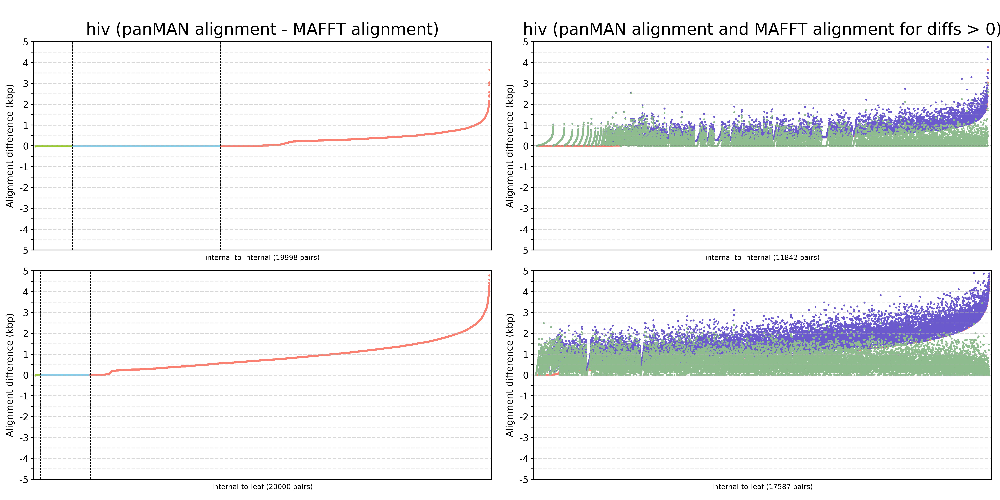

# Evaluate Alignments

Inside evaluate_alignments, `parse_newick_to_pairs.py` is a script that would parse the newick tree and output the parent-child pairs in depth first order. The sequences of each parent-child pair will be compared.

Following commands will generate the pairs, run the alignment comparison, and plot the alignment differences.

```
python parse_newick_to_pairs.py data/hiv/hiv_panman.newick > data/hiv/hiv20000_pairs.tsv

sbatch evaluate_alignments/evaluate_alignments_hiv.sh

python evaluate_alignments/plot_alignment_diff.py evaluate_alignments/out/hiv20000_alignment_differences.tsv evaluate_alignments/data/hiv/hiv20000_pairs.tsv hiv evaluate_alignments/out/hiv20000_alignment_differences.png
```




