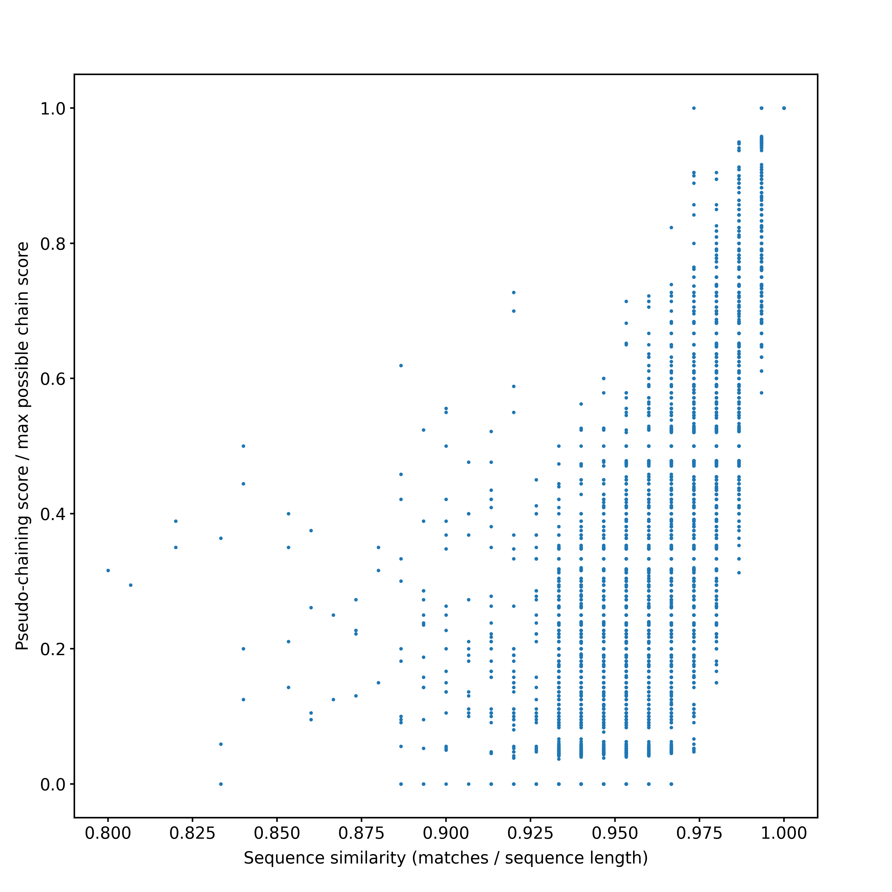

# Pseudo-chaining score vs sequence similarity

To make the pseudo-chaining score vs sequence similarity figure (refer to `2/3/2025`), I'm going to write a script that would give all 150-bp kmers from a random node (preferably containing no ambiguous bases, `OM857280.1`) and generate 50 mutated kmers from each kmer, each containg 1 - 50 mutations. Then I will calculate align them using minimap2 and pseudo-chaining and compare their scores. Scripts and data are placed in `/private/groups/corbettlab/alan/lab_notebook/panmama/pseudo_chaining-vs-sequence_similarity`.

For detail see `panmama/pseudo_chaining-vs-sequence_similarity/README.md`.

\
sequence similarity will be calculated using sam file generated from bwa mem.
```
python3 gen_seq.py OM8572801.fasta > simulated_reads.fastq

bwa mem OM8572801.fasta simulated_reads.fastq > simulated_reads.sam

samtools sort simulated_reads.sam > simulated_reads.sorted.bam

samtools calmd simulated_reads.sorted.bam OM8572801.fasta > simulated_reads.sorted.md.bam

samtools view simulated_reads.sorted.md.bam > simulated_reads.sorted.md.sam
```

\
pseudo-chaining score will be generated by adding code below to `pmi.cpp` after DFS scoring step.
```c++
  // print scores for OM8572801.1
  const auto& nodeScores = allScores.at("OM857280.1");
  std::ofstream nodeScoreOut("OM857280.1.scores.tsv");
  for (size_t i = 0; i < nodeScores.size(); ++i) {
    for (size_t readIdx : readSeedmersDuplicatesIndex[i]) {
      nodeScoreOut << readNames[readIdx] << "\t" << reads[i].seedmersList.size() << "\t" << nodeScores[i].first << "\n";
    }
  }
  nodeScoreOut.close();
```

After rebuilding panmap, run:
```
sbatch get_chain_scores.sh
```
Output is saved in `OM857280.1.scores.tsv`

\
To plot the figure, run:
```
python3 plot_pseudo_chaining_vs_seq_similarity.py simulated_reads.sorted.md.sam OM857280.1.scores.tsv
```



\
Looks not very good.... This is probably not a good comparison. We care more about if pseudo-chaining score is good at **discerning between haplotypes**. Need to find a better way to illustrate this.