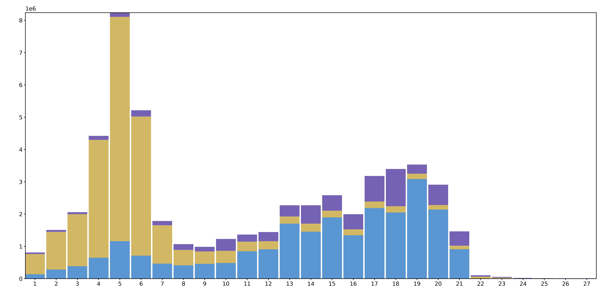
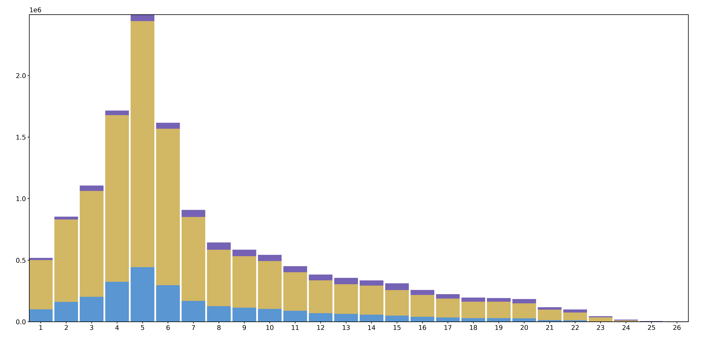
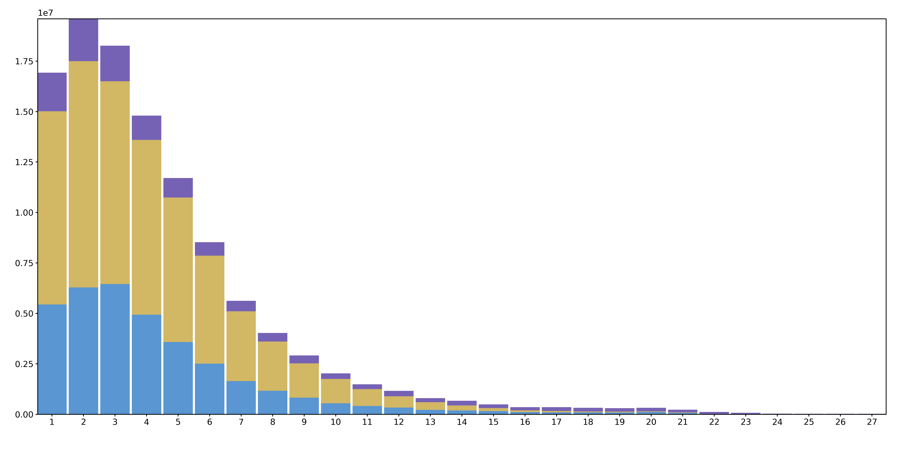

# Runtime optimization

## Distribution of kminmer changes

I'm going to graph the distribution of the types of kminmer changes. Specifically, the number of kminmer changes for a read and the type of kminmer changes (Whether the change had added a kminmer to the chain, removed a kminmer from the chain, or didn't change the chain).

I modified `pmi.cpp` to output some information ([affected_kminmers/sars20000_changes.txt](affected_kminmers/sars20000_changes.txt)) on the affected kminmers for each read at each node. I then wrote a script to parse this information and graph the distribution of the types of kminmer changes.

Added code below right before and after the main loop in `pmi.cpp` that scores the pseudochains.
```cpp
debugOut << "> " << node->identifier << "_before\n";
for (const auto& [readIndex, affectedSeedmerIndices] : readToAffectedSeedmerIndexVec) {
  debugOut << "@" << readIndex << "," << affectedSeedmerIndices.size() << "\n";
  for (const auto& match : reads[readIndex].matches) {
    debugOut << match.first << "," << match.second << " ";
  }
  debugOut << "\n";
  for (const auto& affectedSeedmerIndex : affectedSeedmerIndices) {
    debugOut << affectedSeedmerIndex << " ";
  }
  debugOut << "\n";
}
```

```cpp
debugOut << "> " << node->identifier << "_after\n";
for (const auto& [readIndex, affectedSeedmerIndices] : readToAffectedSeedmerIndexVec) {
  debugOut << "@" << readIndex << "," << affectedSeedmerIndices.size() << "\n";
  for (const auto& match : reads[readIndex].matches) {
    debugOut << match.first << "," << match.second << " ";
  }
  debugOut << "\n";
  for (const auto& affectedSeedmerIndex : affectedSeedmerIndices) {
    debugOut << affectedSeedmerIndex << " ";
  }
  debugOut << "\n";
}
std::cout << std::endl;
```

The read files used to generate the plots are 

- `affected_kminmers/reads/hiv20000_5hap-a_12000_rep1_R*.fastq`
- `affected_kminmers/reads/rsv4000_5hap-a_10000_rep1_R*.fastq`
- `affected_kminmers/reads/sars20000_5hap-a_10000_rep1_R*.fastq`

SARS


RSV


HIV
