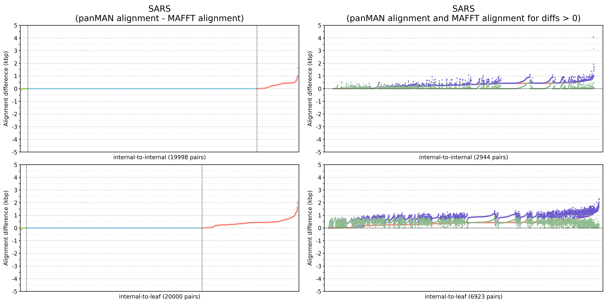
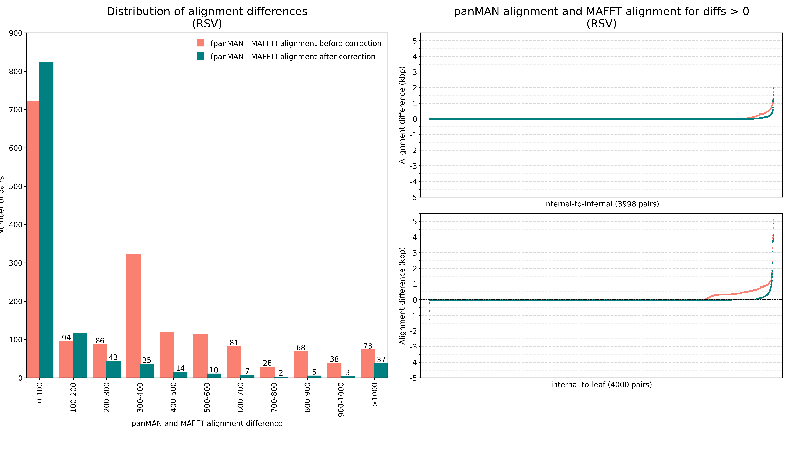

# Evaluate Alignments

[Difference between panMAN alignment MAFFT alignment](#Difference-between-panMAN-alignment-MAFFT-alignment)

[Quantify the prevalence of problematic block states](#quantify-the-prevalence-of-problematic-block-states)


## Difference between panMAN alignment MAFFT alignment
Inside evaluate_alignments, `parse_newick_to_pairs.py` is a script that would parse the newick tree and output the parent-child pairs in depth first order. The sequences of each parent-child pair will be compared.

Following commands will generate the pairs, run the alignment comparison, and plot the alignment differences.

```
python parse_newick_to_pairs.py data/hiv/hiv_panman.newick > data/hiv/hiv20000_pairs.tsv

sbatch evaluate_alignments/evaluate_alignments_hiv.sh

python evaluate_alignments/plot_alignment_diff.py evaluate_alignments/out/hiv20000_alignment_differences.tsv evaluate_alignments/data/hiv/hiv20000_pairs.tsv hiv evaluate_alignments/out/hiv20000_alignment_differences.png
```

**RSV**


\
**New RSV tree**


\
**SARS**


\
**New SARS tree**


\
**HIV**


## Quantify the prevalence of problematic block states

[Examples](#example)

[Scripts](#scripts)

### Example
Use command below to identify examples of alignments where there could be potential problematic block states
```
awk 'BEGIN {OFS="\t"} NR==1 {print $0, "Difference"} NR>1 {print $0, $3-$4}' out/rsv4000_alignment_differences_new.tsv  > out/rsv4000_alignment_differences_new_diff.tsv

tail -n+2 out/rsv4000_alignment_differences_new_diff.tsv | sort -k 5,5 -gr | less
```

Take this entry for example
```
Parent  Child   PanMAN_Diff     MAFFT_Diff      Difference
node_3806       OM857267.1      1542    51      1491
```

PanMAN alignment difference between the two nodes is 1542 while the MAFFT alignment difference is only 51. This drastic difference indicates unopmtimized block states.

Now let's check where misalignments happen betwen the two sequences on a panMAN
```
mkdir example
cp data/rsv/rsv4000_fasta_aligned/{node_3806,OM857267_1}.fasta example/
python3 compare_aligned_sequences.py example/OM857267_1.fasta example/node_3806.fasta --print_ranges
```

```
length  range
2       3643-3644
1       3646-3646
1       3650-3650
7       3652-3658
3       3663-3665
4       3670-3673
3       3675-3677
2       3679-3680
2       3682-3683
39      3685-3723
146     249667-249812
120     249841-249960
146     251858-252003
120     252032-252151
1       284262-284262
1       337600-337600
20      349094-349113
33      349116-349148
160     349205-349364
20      349654-349673
33      349676-349708
160     349765-349924
87      363086-363172
104     363259-363362
15      363364-363378
48      363380-363427
87      364210-364296
104     364383-364486
15      364488-364502
48      364504-364551
10      367685-367694
```

These ranges seems like blocks that could be misaligned. Both 146-size to 120-size blocks have distance 29.
```
146     249667-249812
120     249841-249960
146     251858-252003
120     252032-252151
```

Let's see if their sequences look identical
```
(cat <(tail -n+2 example/OM857267_1.fasta | tr -d '\n') <(echo) <(tail -n+2 example/node_3806.fasta | tr -d '\n')) > example/merged_sequence.txt

cut -c 249668-249813 example/merged_sequence.txt 
cut -c 249842-249961 example/merged_sequence.txt 
cut -c 251859-252004 example/merged_sequence.txt 
cut -c 252033-252152 example/merged_sequence.txt 
```

Comparing the two ranges of size 146:
```
--------------------------------------------------------------------------------------------------------------------------------------------------
AAACACTATACTTGATGACTTCAAAGTGAGTCTAGAATCTATAGGTAGTTTGACACAAGAATTAGAATATAGAGGTGAAAGTCTATTATGCAGTTTAATATTTAGAAATGTATGGTTATATAATCAAATTGCATTACAACTTAAAA

AAACACTATACTTGATGACTTCAAAGTGAGTCTAGAATCTATAGGTAGTTTGACACAAGAATTAGAATATAGAGGTGAAAGTCTATTATGCAGTTTAATATTTAGAAATGTATGGTTATATAATCAAATTGCATTACAACTTAAAA
--------------------------------------------------------------------------------------------------------------------------------------------------
```

Coparing the two ranges of size 120:
```
------------------------------------------------------------------------------------------------------------------------
ATCATGCATTATGTAACAACAAATTATATTTGGATATATTAAAAGTTCTAAAACACTTAAAAACCTTTTTTAATCTTGATAACATTGATACAGCATTAACATTGTATATGAATTTGCCTA
                      :
ATCATGCATTATGTAACAACAAGTTATATTTGGATATATTAAAAGTTCTAAAACACTTAAAAACCTTTTTTAATCTTGATAACATTGATACAGCATTAACATTGTATATGAATTTGCCTA
------------------------------------------------------------------------------------------------------------------------
```

So they are indeed highly similar. The 146-long blocks are identical while the 120-long blocks are only 1 snp apart.

Now check the sequences between the ranges
```
cut -c 249815-249842 example/merged_sequence.txt
cut -c 252006-252033 example/merged_sequence.txt 
cut -c 249963-251859 example/merged_sequence.txt 
```

```
----------------------------
---------------------------A

---------------------------A
----------------------------

------------------------------------------------------------------------------------------------------------------------------------------------------------------------------------------------------------------------------------------------------------------------------------------------------------------------------------------------------------------------------------------------------------------------------------------------------------------------------------------------------------------------------------------------------------------------------------------------------------------------------------------------------------------------------------------------------------------------------------------------------------------------------------------------------------------------------------------------------------------------------------------------------------------------------------------------------------------------------------------------------------------------------------------------------------------------------------------------------------------------------------------------------------------------------------------------------------------------------------------------------------------------------------------------------------------------------------------------------------------------------------------------------------------------------------------------------------------------------------------------------------------------------------------------------------------------------------------------------------------------------------------------------------------------------------------------------------------------------------------------------------------------------------------------------------------------------------------------------------------------------------------------------------------------------------------------------------------------A
-------------------------------------------------------------------------------------------------------------------------------------------------------------------------------------------------------------------------------------------------------------------------------------------------------------------------------------------------------------------------------------------------------------------------------------------------------------------------------------------------------------------------------------------------------------------------------------------------------------------------------------------------------------------------------------------------------------------------------------------------------------------------------------------------------------------------------------------------------------------------------------------------------------------------------------------------------------------------------------------------------------------------------------------------------------------------------------------------------------------------------------------------------------------------------------------------------------------------------------------------------------------------------------------------------------------------------------------------------------------------------------------------------------------------------------------------------------------------------------------------------------------------------------------------------------------------------------------------------------------------------------------------------------------------------------------------------------------------------------------------------------------------------------------------------------------------------------------------------------------------------------------------------------------------------------------------------------------------
```

The sequences between each 120-block and 146-block are identical. The sequence between two 140-120-block pairs is all gaps for one of the nodes. This allows use to swap the 120-146 block pairs for one of the nodes to fix the alignments.

### Scripts

#### Old panMANs

##### Get the block ranges

I need to first get the ranges of all the blocks. Not gonna bother to write a new function so I will add a couple lines to existing pipeline and do a dummy run just to get the block ranges.

To do this add code below in `pmi::place_per_read` function in `pmi.cpp` in `panmap` src directory.

```cpp
std::ofstream blockRangesFile(prefix + ".block_ranges.tsv");
for (const auto& range : blockRanges) {
  blockRangesFile << range.first << "\t" << range.second << std::endl;
}
blockRangesFile.close();
```

After rebuild, run command below for each tree. Using the old panMANs for now since they seem to look better than the new panMANs (I think the only difference is that old panMANs were encoded using protobuff and new panMANs are encoded using capnproto).

```
/private/groups/corbettlab/alan/panmap/build/bin/panmap /private/groups/corbettlab/alan/panmama-snakemake/workflow/evals/rsv/k19_s8_null/panman_index/rsv4000.panman data/dummy.fastq --place-per-read --prefix data/rsv --preem-filter-method mbc --redo-read-threshold 0
```

Remove output files we don't need. Rename and move the block_range file

```
rm data/rsv.abundance data/rsv.error.log data/rsv_filtered_nodes.txt data/rsv.log
mv data/rsv.block_ranges.tsv data/rsv/rsv4000_block_ranges.tsv
```

Make sure to delete the temporary code and rebuild to restore codebase and executables to orignal state.

##### Look for misaligned blocks

`search_ma_blocks.py` a python script that looks for misaligned blocks in which two different blocks with identical sequences were turned on between a parent and a child node. It outputs the number of mismatches in the misaligned blocks, the number of mismatches in the misaligned blocks after corrections, the mismatch count of the entire original sequence, and the expected number of mismatches of the entire sequence after correction.

```
python3 search_ma_blocks.py example/KF973330_1.fasta example/node_82.fasta --block_ranges data/rsv/rsv4000_block_ranges.tsv
```

```
#mismatch_count_in_ma_blocks: 1222
#mismatch_count_in_corrected_blocks: 0
#all_mismatch_count: 1226
#expected_mismatch_count_after_correction: 4
#block1 block2  mismatch_count  num_nuc_pairs
109     110     0       162
175     184     0       225
182     197     0       224
```

The following commands run the `search_ma_blocks.py` for every pair, and plot the expected results after the correction of misaligned nodes.
```
sbatch evaluate_ma_blocks_rsv.sh

python3 plot_ma_correct.py out/rsv4000_alignment_exepcted_correction.tsv data/rsv/rsv4000_pairs.tsv RSV out/rsv4000_alignment_exepcted_correction.png
```

**RSV**


\
**SARS**


\
**HIV**


#### New panMANs

##### Get the block ranges

In my [forked panman](https://github.com/AlanZhangUCSC/panman), I added a function in `summary.cpp` to print block ranges of an input tree to a tsv file

```
panmanUtils panmans/rsv4000.panman --block-ranges -o rsv4000_block_ranges.tsv
```

I also added a function in `fasta.cpp` to output a random subset of node pairs from a tree (If `num-subset` is greater than total number of nodes in the tree all pairs are printed).

```
panmanUtils panmans/rsv4000.panman -F --num-subset 99999999
```

**unaligned** sequences are output in standard **fasta** format

**aligned** sequences are output in a "**fastags**" format where blocks are split into lines and off blocks are represented as '.'

An example of fastags format
```
.
------------------------------------------------------------------------TGGGGCAAATGCAAACATGTCCAAAACCAAGGACCAACGCACCGCCAAGACACTAGAGAGGACCTGGGACACTCTCAATCATCTA>
--C-------AAAGTCACACTAACAACTGCAATCATACAAGATGCAACGAACCAGATCAAGAACACAACCCCAACATACCTTACCCAGAATCCCCAGCTTGGAATCATCTTCTCCAATCTGTCCGGAACTACATCACAATCCACCACCATACTAGCC>
.
.
CCAAATATCACCTAGCAAACCCACCACAAAACAACGCCAAAATAAACCACAAAACAAACCCAACAATGATTTTCACTTTGAAGTGTTCAATTTTGTACCCT
.
.
```

This allows efficient storage and comparison of panMAN aligned sequences.

Everything should be output to an `info/` folder. Move and rename the foler.

```
mv info panmans/rsv4000_sequences
```

Use the new `search_ma_blocks_new_panman.py` to look for potential misaligned blocks.

```
python3 search_ma_blocks_new_panman.py rsv4000_sequences/KF973330_1.aligned.fastags rsv4000_sequences/node_82.aligned.fastags
```

```
#total_diffs: 1202
#corrected_diffs: 228
#diffs_in_corrected_blocks: 1
#fastags_file_1:../../../panmania/panman/panmans/rsv4000_sequences/KF973330_1.aligned.fastags
#fastags_file_2:../../../panmania/panman/panmans/rsv4000_sequences/node_82.aligned.fastags
#ma_block_1     ma_block_2      num_diffs       num_nuc_pairs   num_mismatched_nuc_pairs
373     367     0       249     0
255     272     1       238     1
```

```
sbatch evaluate_ma_blocks_new_rsv.sh
```

Plot the results of RSV, HIV, SARS, and SARS8mil.

```
python3 plot_ma_correct_new_panman.py out/rsv4000_alignment_exepcted_correction_new_panman.tsv 'new RSV panman' out/rsv4000_alignment_exepcted_correction_new_panman.png
```

Plot the results of TB. TB panMAN alignments were compared to minimap2 alignments because they are too big to align with MAFFT. 

```
python3 plot_ma_correct_new_tb.py out/tb400_alignment_exepcted_correction_new_panman.tsv 'new TB panman' out/tb400_alignment_exepcted_correction_new_panman.png
```


