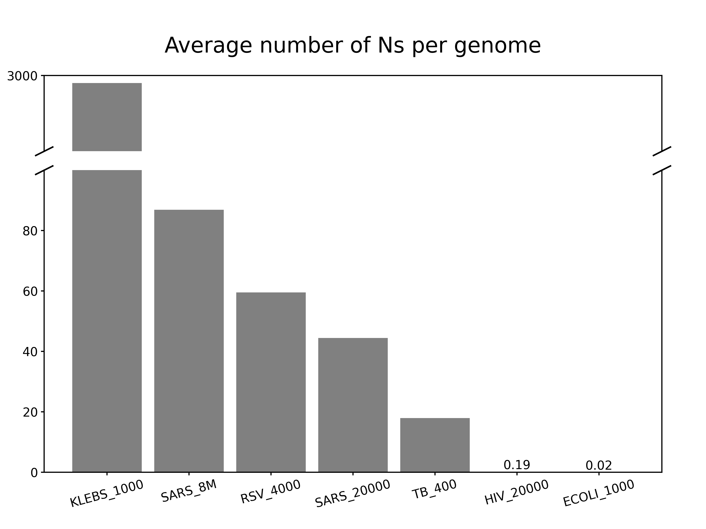
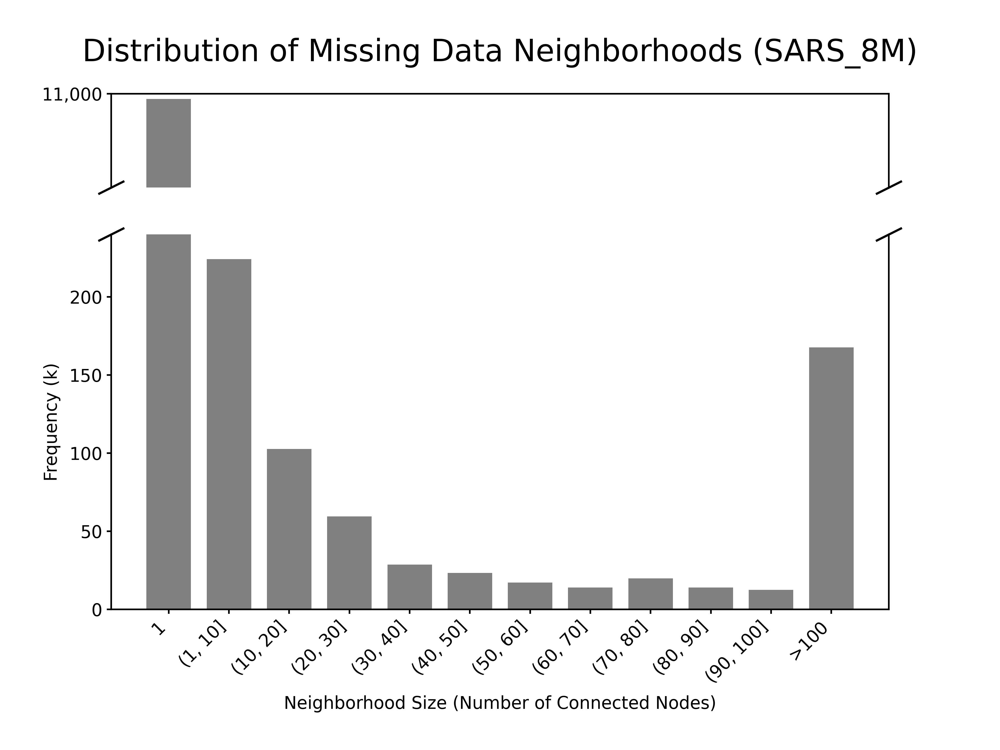

# PanMANIA - Imputation

This is a sub-notebook for the imputation part of the panMANIA project. Thanks to Faith Okamoto's amazing rotation project, I have some really good preliminary data and code to work with.

Material by Faith Okamoto (I copied over Faith's google docs to my google drive in case they somehow disappear from the internet):

[Project Summary](https://docs.google.com/document/d/1D4OWInb7jSm_5gwr64NLYzfNWDB0bT8gZB6tRxA5Wh0/edit?usp=sharing)

[Project Notebook](https://docs.google.com/document/d/1LL629A8EUAJTXlryVf45K_Sg3gTvaWi6BpbV3mg3gW0/edit?usp=sharing)

[Final Poster](https://docs.google.com/presentation/d/1iuJhy3uWQ0p_x0ZyfQ85A8GjPe5537G96T4NtV5VVdw/edit?usp=sharing)

[Code on github](https://github.com/faithokamoto/panman)

## 3/23/2025

I want to make a figure that shows the proportion of data containing missing DNAs (non-canonical bases) in the panMANs.

## 3/25/2025

I added a `--missing-data-summary` flag to `panmanUtils`. It outputs the number of substitutions/insertions that create missing data and the total number of missing data (N) across all nodes on the panMAT; the top 10 nodes that have the most missing data and top 10 global coordinates that have the most nodes that contain missing data at the coordinate; and the distribution of the sizes of the connected components of the missing data (where a missing data at a coordinate occurs in contiguous nodes). See [github](https://github.com/AlanZhangUCSC/panman) for code.

```
panmanUtils -I sars_8M.panman --missing-data-summary -o sars_8M
```

Use `plot_N_per_base.py` to plot the number of Ns per base for all the panMANs I have.

```
python3 scripts/plot_Ns_per_genome.py \
  -m ../data/info/rsv_4000.panman_0.missing_data.summary ../data/info/sars_20000_0.missing_data.summary ../data/info/sars_8M_0.missing_data.summary ../data/info/HIV_20000_0.missing_data.summary ../data/info/klebs_1000_0.missing_data.summary ../data/info/ecoli_1000_0.missing_data.summary ../data/info/tb_400_0.missing_data.summary \
  -s ../data/info/rsv_4000_0.summary ../data/info/sars_20000_0.summary ../data/info/sars_8M_0.summary  ../data/info/HIV_20000_0.summary ../data/info/klebs_1000_0.summary  ../data/info/ecoli_1000_0.summary ../data/info/tb_400_0.summary \
  -n RSV_4000 SARS_20000 SARS_8M HIV_20000 KLEBS_1000 ECOLI_1000 TB_400 \
  -o Ns_per_genome.png
```

Below is the average number of Ns per base for each species.

```
KLEBS_1000: 0.0004938270601832353 (average 2712.03 Ns per genomes)
SARS_8M: 0.002895732789447748 (average 86.87 Ns per genomes)
RSV_4000: 0.0039167724912982545 (average 59.53 Ns per genomes)
SARS_20000: 0.0014821887213847013 (average 44.47 Ns per genomes)
TB_400: 4.08209125042667e-06 (average 17.96 Ns per genomes)
HIV_20000: 1.9018424178553183e-05 (average 0.19 Ns per genomes)
ECOLI_1000: 4.302151075537769e-09 (average 0.02 Ns per genomes)
```



And the distribution of the counts of connected components of missing data.

```
python3 plot_connected_componenets_dist.py ../data/info/sars_8M_0.missing_data.summary -t 'Distribution of Missing Data Neighborhoods' -o connected_components_distribution
```


